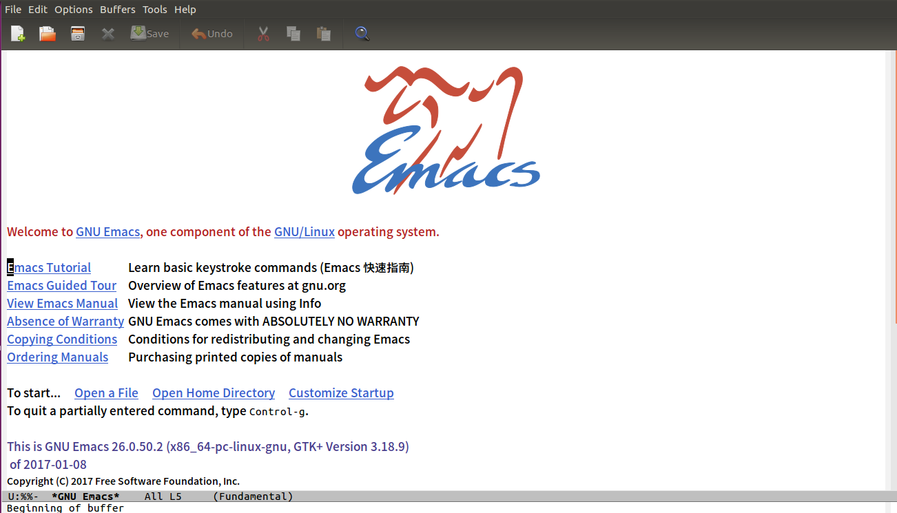
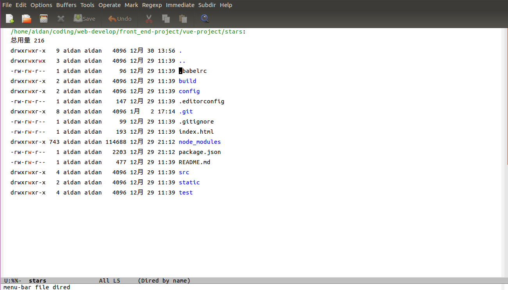

终于找到了一个自己喜欢的编辑器 - Emacs

# 1 Emacs是什么？

Emacs是一种功能超强的文本处理程序，或者文本编辑器。作者Richard Stallman（主
页:http://stallman.org/）。基础部分是使用C语言编写的，其他部分是用Emacs Lisp编写的。深层次的话，C语言构成了emacs的底层，包括Emacs Lisp的解释器。而Emacs Lisp则是负责了Emacs Lisp的建筑物上层，也就是包括我们平时用的扩展、界面等。

Emacs只是一文本编辑器，这和Windows上的Visual Studio等等不同的是，VS集成的是完整的开发功能，包括编译器、编辑器、调试器等等。而Emacs只是一个文本编辑器，当然不要因此而是否定Emacs的强大。Emacs可以做的:

- 收发电子邮件、通过FTP/TRAMP编辑远程档案、通过Telnet登录主机、上新闻组、登陆IRC和朋友交流

- 查看日历、撰写文章大纲
　　
- 对多种编程语言的编辑、调试程序，结合GDB，EDebug等。支持C/C++，Perl，Python，Lisp等等
　　
- 玩游戏、计算器、记日记
　　
- 煮咖啡、管理日程，Task，ToDo，约会等、个人信息管理、目录管理

- 文件比较、阅读info和man文档、浏览网站

他确实只是一个文本处理器，你可以将之视为伪编辑器的操作系统。而这是因为其与unix/Linux系统的整合程度而起的，换句说，如果Richard Stallman可以早点开发出内核，而不是等到Linux的话。Linux/Unix的设计思想之一就是：简单，使用足够的小程序来支撑起这世界，而是Emacs所做的就是利用这些工具，来打造自己，完成自己的系统。因而，Emacs强大的另一点是，有足够的扩展，无论是过去的auto-complete或者是现在的Android-mode等等。故而，我们可以在《架构之美》之中看到关于其的介绍，而是他的特性也是如此，滋长的特性是其优势。

也因些，Emacs是Unix世界的两大神器之一，另外一个是Vim/Vi。

# 2 Emacs是什么样的？

Emacs的设计预想是需要时只需要启动一次，然后一直运行着。我们可以对窗口进行分割，打开多个文件进行编辑。Emacs的三种基本对象是:帧(frame)、窗口(window)、缓冲区(buffer)。

# 3 Emacs 的基本概念

## 3.1 frame

Emacs中的frame就是操作系统中的窗口.

buffer是文件的内存表示, windows则是显示buffer的区域, 一个frame中可以有多个window, Emacs则可以有多个frame.

## 3.2 window

窗口. 由于Emacs很早就诞生了, 它的窗口概念和现在基于窗口的操作系统中的窗口概念不是一样的. Emacs中的窗口是用来显示buffer的一个区域. 它并不像操作系统中的窗口拥有自己的标题栏,系统菜单栏.

## 3.3buffer

缓冲区. Emacs并不直接对文件进行操作, 它是把文件加载进buffer, 用户直接操作buffer, 只有当用户确定把buffer中所做的修改写人文件时, Emacs才把buffer中的内容写入文件. buffer实际上就是一个内存缓冲区, 这和一般编辑器中都一样, 应该很好理解.

## 3.4 Emacs Lisp

Emacs最基础的部分是用c写的，其他部分都是用Emacs Lisp语言写的，Emacs Lisp语言是基于lisp语言的. lisp是LISt Processor的缩写, 即链表处理语言, 所以lisp语言的操作都是基于链表的, 它的语法也是链表结构, 链表第一个元素表示函数名, 其他元素是参数, 比如通常语言中的a+b, 在lisp就是(+ a b)

## 3.5 mode

mode有major mode和minor mode之分, 每个缓冲区对应一个major mode, 也只有一个major mode, 但是可以有多个minor mode. Emacs对每一种文件都有一个mode.

## 3.6 命令

你对Emacs所有的操作都是对Emacs的命令的调用。比如，你在text-mode里，当你按下任何字母键进行编辑的时候，实际上是调用的emacs的命令self-insert-command.

## 3.7 快捷键

Emacs中Control键用C表示,Alt键用M表示, 即: C-c表示Control C, M-x表示Alt x.

除掉以Alt键开头的，比如Alt a，Emacs中的快捷键基本上都有一个前缀，Emacs中最多的快捷键前缀就是C-x，C-c，前缀表示，你不必要一起按下前缀和后缀，可以先按下前缀，Emacs会等待你按下剩余的快捷键，这样Emacs中的快捷键按起来非常的方便。

## 3.8 keymap

键盘映射. Emacs的快捷键是通过keymap来控制的. 有全局和局部的keymap. 每个mode都会有一个自己的局部的keymap, 局部的keymap会覆盖全局的keymap, 另外如果对应的major mode有开启的minor mode, 而且这个minor mode有keymap的话, 这个minor mode的keymap会覆盖major mode的keymap.

>参考资料
>[Emacs入门系列：尝试定制神器](http://www.jianshu.com/p/ee37f00f8f65)
>[Emacs 入门指引（一） Emacs简介](http://blog.csdn.net/phodal/article/details/7724635)
>[Emacs基础知识简介](http://os.51cto.com/art/201109/291709.htm)
