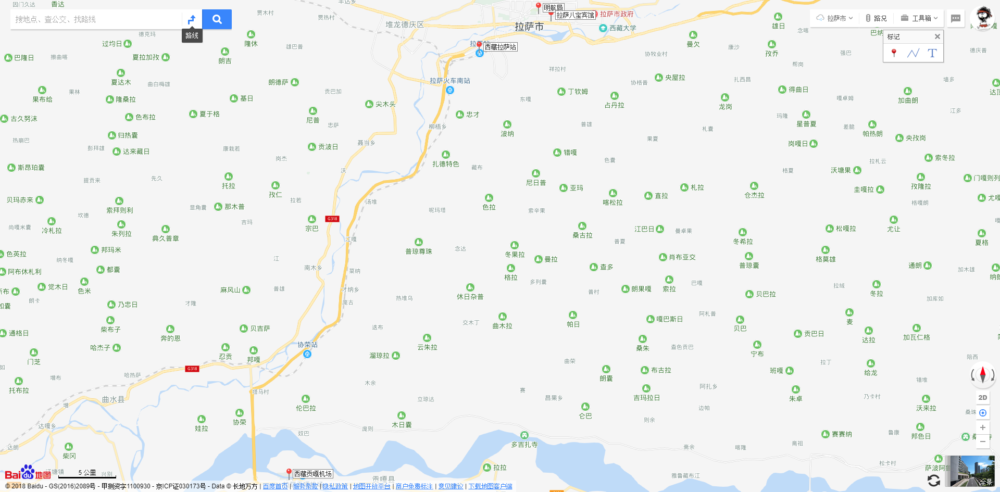
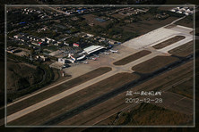
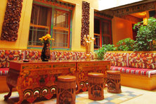
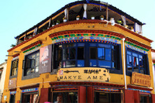
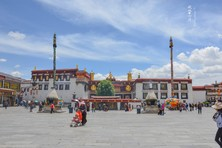
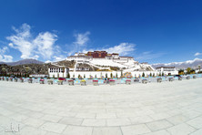
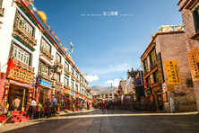

# 1 交通

去：09-28 周五 西安-拉萨 经济舱

咸阳机场T2 - 贡嘎机场 (06:00 ~ 09:00)

https://flight.qunar.com/site/oneway_list.htm?searchDepartureAirport=%E8%A5%BF%E5%AE%89&searchArrivalAirport=%E6%8B%89%E8%90%A8&searchDepartureTime=2018-09-28&searchArrivalTime=2018-08-03&nextNDays=0&startSearch=true&fromCode=SIA&toCode=LXA&from=flight_dom_search&lowestPrice=null

回：10-05 周五 拉萨-西安 Z166 硬卧

拉萨 - 西安 (11:30 ~ 次日 20:34)

https://kyfw.12306.cn/otn/leftTicket/init

# 2 设备

文件类：身份证 机票 银行卡 现金 各种会员卡
电子电器：手机 相机/DV Mp3/Mp4 移动电源 数据线 照明灯具 备用电池
日用品：行李包 水杯 火柴，防风火机
衣物：备换衣服 备换鞋
药品：抗高反药品
地图：https://item.jd.com/25582279803.html https://item.jd.com/29286834211.html

# 3 景点

## Day 1 西安 -> 拉萨

>今日重点：当天 9 点到机场，然后乘坐机场大巴到 11 点左右到拉萨八宝宾馆；安顿好行李，休息一下；然厚下午在拉萨的街头游走了那么一整天，回头想想，其实正好适应了高反；第一天去可能会有高原反应，天旋地转，跟喝多了一样，处理方法也跟喝多酒一样，别zuo，躺下别动，喘气，睡一会就好了

### 第1站 贡嘎国际机场

作者贴士：红眼航班加上必须晚点的国内航班，晚上1点多到拉萨是理所当然的咯，机场到市区会有大巴，早点上车，抓紧行李，别相信当地的司机

地址：西藏自治区山南地区贡嘎县甲竹林镇

简介： 位于西藏自治区山南地区贡嘎县甲竹林镇，坐落在壮丽的雅鲁藏布江南岸，海拔3600米，是世界上海拔最高的民用机场之一。2007年机场旅客吞吐量达1187104人次。

两地相距 45.76公里

### 第2站 拉萨八宝宾馆

作者贴士：几乎所有带天台的宾馆都能看到布宫，所以选旅店的时候不要太注重商家的这个噱头，这家酒店的锁头挺有特色的，几乎所有的房客都会拍张照片炫耀一下，藏式宾馆的特点就是民宿风格，期待不要太高

参考价格：￥197

简介： 必读 位于拉萨老城区的中心位子，地理位置优越，距离**八廓街步行1分钟路程**，**大昭寺步行3分钟路程**。 整座建筑为藏式建筑，内部全部采用传统藏族手绘图案装饰，具有强烈的当地民族特色。 每间房间都拥有独立卫生间、24小时热水、32寸液晶电视，有免费无线上网。 贴士 有“阳光”和“洞天阁”2个餐厅，“洞天阁”位于屋顶，在这里你能够眺望布达拉宫的雄姿，欣赏拉萨的老城风光。 宾馆还有一只叫王小虎的肥猫，好可爱。 进门老板会送上甜茶，店里的卓玛很会唱歌，还会做尼泊尔菜。收起

两地相距 0.11公里

### 第3站 玛吉阿米西餐吧

作者贴士：进藏的第一天就钻进了玛吉阿米，八角街上最著名的景点之一，一楼的门脸很小，让人感觉很憋屈，二楼的座位稍微舒适点，不过有点臭臭的味道，强烈建议三楼靠窗的位置，中午带上耳塞机坐在窗口，懒懒的晒会太阳，舒服死了。注意下餐厅里的那个小骗子

地址：拉萨市八廓街东南角

简介：玛吉阿米位于**大昭寺旁**，相传是仓央嘉措与情人相遇的地方，如今成了游客必打卡的餐厅之一。 店内具有浓郁的藏式风情，窗台上摆放着许多留言本，写满世界各地旅游者的感受。 三楼露台是俯瞰八廓街的绝佳位置，在这里喝茶、晒太阳是一种享受。 特色菜有生烤羊排、酸萝卜炒牛肉、浇汁牛舌等，甜茶、酸奶蛋糕也备受欢迎。

两地相距 0.3公里

### 第4站 大昭寺广场

作者贴士：拉萨之行的主要景点，因为我住在八廓街上，所以每天都要在大昭寺广场上呆一会，著名的艳遇墙就在这，相信命运，相信传说，在这里一定会有艳遇的，无论你是怎样路过的，呵呵，反正我是每天都在这里呆特么一会

用时参考：半小时

地址：拉萨市城关区八角街

门票： 免费

简介： 广场上常年聚集着许多磕长头朝拜的藏民，是拍人文片的好地方。同时，这里也是拍摄大昭寺的好角度。

两地相距 1.29公里

### 第5站 布达拉宫广场

作者贴士：三步一岗五步一哨，非常安全的地方，在这里席地而坐是不可能的，不过这里可以看见巍峨的布宫，还有夜色中的布达拉，跟着抗三脚架的人就能找到合适的拍摄地点，通常是要排队的，第一天去不建议过于兴奋的在布宫广场上蹦蹦跳跳的，容易引发高反

用时参考：0.5-1小时

地址：北京中路35号(西藏石油公司旁)

门票： 免费

简介： 布达拉宫广场是世界上海拔最高的城市广场，拉萨许多重要的活动都在此举行。站在广场上仰望布达拉宫，你更能体会到它雄伟、神圣的一面。 如果说白天的广场让你震撼，那这里的夜景则让你看见它略显柔情的一面。灯光的照射下的布宫别有风情，广场上的音乐喷泉也颇有情调，还有许多人随着音乐一齐跳舞。

两地相距 1.42公里

### 第6站 八廓街

作者贴士：早上八九点钟是最有感觉的时候，香雾缭绕的，转经的信徒们默念着经文，登上高出拍张逆光点的照片，好像僵尸袭城一样别有一番感觉，买东西一定要砍价，不要认为自己占了便宜，只要你买了东西就一定是被宰了，呵呵

用时参考：3-4小时

地址：拉萨市城关区

门票： 免费

简介： 位于旧城区的八廓街又名“八角街”，是拉萨最著名的转经道和商业中心。 它原本只是环绕大昭寺的转经道，被藏族人成为“圣路”，而现在却逐渐扩展为围绕大昭寺周围的大片旧式老街区的统称。 街上永远少不了朝拜的藏民，也少不了藏式店铺。临街的房子几乎都是商店，贩卖各种藏族服饰、工艺品，还有来自印度、尼泊尔等地的商品。 美食自然也是少不了的，许多拉萨名餐馆就位于此，如玛吉阿米、临夏风味王中王、光明港琼甜茶馆等，让你一次尝遍各种藏式美食。 八廓街附近还有下密院、印经院、席德寺废墟、仓姑尼庵、清真寺等宗教文化圣地，可以充分领略多种文化的神秘碰撞。

# 参考链接

- https://www.mafengwo.cn/schedule/206899.html
- http://www.mafengwo.cn/gonglve/ziyouxing/2519.html
- http://www.mafengwo.cn/gonglve/ziyouxing/297.html
- https://j.map.baidu.com/2sznZ
- http://you.ctrip.com/map/lhasa36.html
