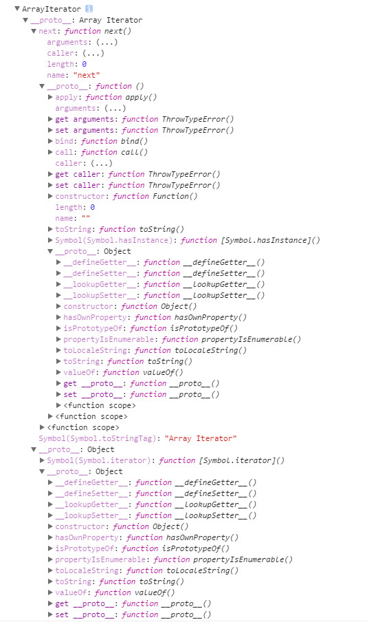
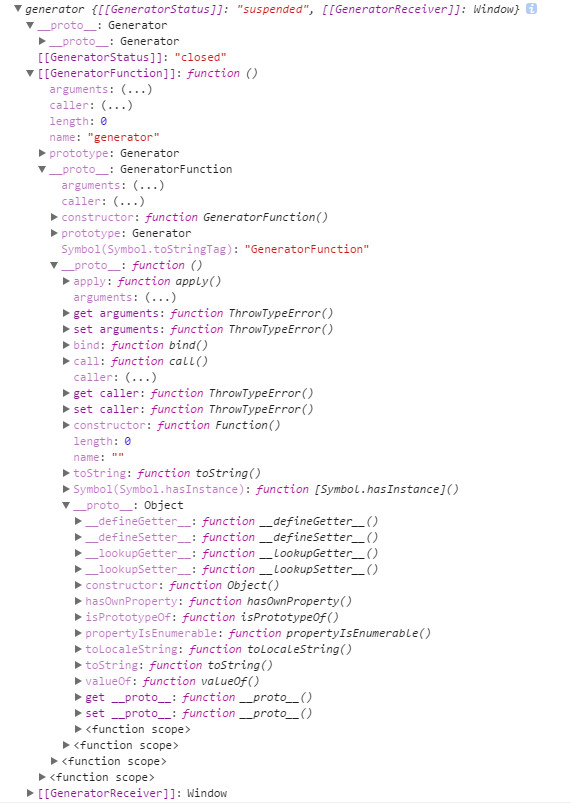

ECMAScript2016 中引入了 Iterator 和 Generator，网上有很多介绍怎么使用的文章，但是往往不够深入，为了彻底弄明白它哥俩，自己花了一天时间总结如下。

# 1 曾经我们写过的代码

## 1.1 for

我们如何遍历数组中的元素？20年前JavaScript刚萌生时，我们是这样实现数组遍历：

```javascript
for (var index = 0, len = myArray.length; index < len; index += 1) {
  console.log(myArray[index]);
}
```

## 1.2 forEach()

自ES5正式发布后，你可以使用内建的forEach方法来遍历数组：

```javascript
myArray.forEach(function (value) {
	console.log(value);
});
```

这段代码看起来更加简洁，但这种方法也有一个小缺陷：你不能使用 `break`语句中断循环，也不能使用 `return` 语句返回到外层函数。

当然，如果只用 `for` 循环的语法来遍历数组元素也很不错。

## 1.3 for-in

那么，你一定想尝试一下 `for-in` 循环：

```javascript
for (var index in myArray) { // 千万别这样做
  console.log(myArray[index]);
}
```

这绝对是一个糟糕的选择，为什么呢？

- 在这段代码中，赋给 `index` 的值不是实际的数字，而是字符串 “0”、“1”、“2” ，此时很可能在无意之间进行字符串算数计算，例如：“2” + 1 == “21”，这给编码过程带来极大的不便。

- 作用于数组的 `for-in` 循环体除了遍历数组元素外，还会遍历自定义属性。举个例子，如果你的数组中有一个可枚举属性 `myArray.name` ，循环将额外执行一次，遍历到名为 “name” 的索引。就连数组原型链上的属性都能被访问到。

- 最让人震惊的是，在某些情况下，这段代码可能按照随机顺序遍历数组元素。

- 简而言之，`for-in` 是为普通对象设计的，你可以遍历得到字符串类型的键，因此不适用于数组遍历。

## 1.4 for-of

而现在有了 ECMAScript2015 我们可以用强大的 `for-of` 来遍历数组。

```javascript
for (let value of myArray) {
  console.log(value);
}
```

是的，与之前的内建方法相比，这种循环方式看起来是否有些眼熟？那好，我们将要探究一下for-of循环的外表下隐藏着哪些强大的功能。现在，只需记住：

- 这是最简洁、最直接的遍历数组元素的语法
- 这个方法避开了 `for-in` 循环的所有缺陷
- 与 `forEach()` 不同的是，它可以正确响应 `break`、 `continue` 和 `return` 语句

`for-in` 循环用来遍历对象属性。

`for-of`循环用来遍历数据—例如数组中的值。

但是，不仅如此！

`for-of` 循环不仅支持数组，还支持大多数类数组对象，例如 `DOM NodeList` 对象。

`for-of` 循环也支持字符串遍历，它将字符串视为一系列的 Unicode 字符来进行遍历：

```javascript
for (let char of "Aidan") {
  console.log(char);
}
```

它同样支持 `Map` 和 `Set` 对象遍历。

为什么 `for-of` 如此的强大呢？现在我来告诉你，因为 Iterator （迭代器）；遍历器（Iterator）是这样一种机制。它是一种接口，为各种不同的数据结构提供统一的访问机制。任何数据结构只要部署 Iterator 接口，就可以完成 `for-of` 遍历操作（即依次处理该数据结构的所有成员）。

# 2 初识 Iterator （迭代器）和 Generator （生成器）

## 2.1 迭代协议

作为 ECMAScript 2015 (ES6)新增加的一部分，它不是新语法或一个新的内置对象，而是一种协议(protocol)。这种协议能被任何遵循某些约定的对象实现。

它们是两类协议：可遍历（可迭代）协议和迭代器协议。

### 2.1.1 可遍历（可迭代）协议

可遍历（可迭代）协议允许 JavaScript 对象去定义或定制它们的迭代行为, 例如（定义）在一个 `for-of` 结构中什么值可以被循环（得到）。一些内置类型都是内置的可遍历对象并且有默认的迭代行为, 比如 `Array` or `Map`, 另一些类型则不是 (比如 `Object`) 。

为了变成可遍历对象， 一个对象必须实现 `@@iterator` 方法, 意思是这个对象（或者它原型链 `prototype chain` 上的某个对象）必须有一个名字是 `Symbol.iterator` 的属性:

|属性 |值   |
|:----|:----|
|[Symbol.iterator]	|返回一个对象的无参函数，被返回对象符合迭代器协议。当一个对象需要被遍历的时候（比如开始用于一个 `for-of` 循环中），它的 `@@iterator` 方法被调用并且无参数，然后返回一个用于在遍历中获得值的迭代器。|

### 2.1.2 迭代器协议

迭代器协议定义了一种标准的方式来产生一个有限或无限序列的值。

当一个对象被认为是一个迭代器时，它实现了一个 next() 的方法并且拥有以下含义：

|属性 |值   |
|:----|:----|
|next |  返回一个对象的无参函数，被返回对象拥有两个属性：<br/>  done (boolean) <br/> 如果迭代器已经经过了被迭代序列时为 true。这时 value <br/> 可能描述了该迭代器的返回值。返回值在这里有更多解释。 <br/> 如果迭代器可以产生序列中的下一个值，则为 false。这等效于连同 done 属性也不指定。<br/> value - 迭代器返回的任何 JavaScript 值。done 为 true 时可省略。|

具体请参考：[Javascript(MDN：迭代协议)](https://developer.mozilla.org/zh-CN/docs/Web/JavaScript/Reference/Iteration_protocols)

## 2.2 实现可遍历对象

根据可遍历（可迭代）协议我们可以如下实现一个可遍历对象：

```javascript
let objPerson = {
	name: "Aidan",
	age: 23,
	job: "Junier Front-end Egnieer",
	local: "ShanXi",
	[Symbol.iterator]: function(){
		var keys = Object.keys(this).sort(),
			len = keys.length,
			index = 0,
			that = this; // 注意

		return {
			next: function(){
				return index < len
					? {value: that[keys[index++]], done: false}
					: {value: undefined, done: true};
			}
		}
	}
}

for(let val of objPerson){
	console.log(val);
}
// 23
// Junier Front-end Egnieer
// ShanXi
// Aidan

let ite = objPerson[Symbol.iterator]();
console.log(ite.next());
console.log(ite.next());
console.log(ite.next());
console.log(ite.next());
console.log(ite.next());
console.log(ite.next());
// { value: 23, done: false }
// { value: 'Junier Front-end Egnieer', done: false }
// { value: 'ShanXi', done: false }
// { value: 'Aidan', done: false }
// { value: undefined, done: true }
// { value: undefined, done: true }
```

迭代器允许我们在第一次调用 `next()` 函数之后，再执行相应的逻辑。在上面的例子里，当我们调用迭代器的瞬间，我们就立刻执行了排序和取值的工作。但是，如果 `next()`函数永远不被调用的话，我们就浪费了性能。所以让我们来优化它：

```javascript
let objPerson = {
	name: "Aidan",
	age: 23,
	job: "Junier Front-end Egnieer",
	local: "ShanXi",
	[Symbol.iterator]: function(){
		var keys = null,
			len = null,
			index = 0,
			that = this; // 注意

		return {
			next: function(){
				if(keys === null){
					keys = Object.keys(that).sort();  // 惰性执行
					len = keys.length;
				}
				return index < len
					? {value: that[keys[index++]], done: false}
					: {value: undefined, done: true};
			}
		}
	}
}
```

至此可遍历对象已经完美实现，perfect!

## 2.3  hello, Generator （生成器）!

```javascript
function* generator () {
	for(let i=0; i<5; i+=1){
		yield i;
	}
}

let gen = generator();

console.log(gen.next());
console.log(gen.next());
console.log(gen.next());
console.log(gen.next());
console.log(gen.next());
console.log(gen.next());
console.log(gen.next());

for(let val of gen){
	console.log(val);
}
```

## 2.4 Generator for Iterator

```javascript
let objPerson = {
	name: "Aidan",
	age: 23,
	job: "Junier Front-end Egnieer",
	local: "ShanXi",
	[Symbol.iterator]: function* () {
		var keys = Object.keys(this).sort();

		for(let item of keys){
			yield this[item];
		}
	}
};
```

# 3 ECMAScript2015 中的 Iterator 和 Generator

## 3.1 Iterator 与 Array 等

你不曾疑惑吗？Array、Set、Map 中的 Iterator 是如何实现的呢？当你在浏览器控制台运行以下代码时，哦，原来是这样！（如下图）

```javascript
let arr = [1, 2, 3, 4, 5],
	ite = arr[Symbol.iterator]();

console.log(ite);
```

原型链！原型链！原型链！



Iterator 和 Array 有何关系？还是很让人费解的？

```javascript
let arr = [1, 2, 3, 4, 5, 6, 7, 8, 9, 10],
	ite = arr[Symbol.iterator]();

console.log(Reflect.ownKeys(Array));

for(let val of ite){
	console.log(val);
}
```

既无继承又无注入，到底是怎么实现的呢？

大家还记得前面提到过的 `可遍历（可迭代）协议` 吗？如果不记得了，可以倒回去看看；原来数组原型上实现了 `Array.prototype[@@iterator]()` 方法，当我们调用 Array[Symbol.iterator] 时，它的 `@@iterator` 方法被调用并且无参数，然后返回一个用于在遍历中获得值的迭代器。于是数组就是可迭代对象了。这是语言层面的设计，具体如何实现的大家可以再研究，欢迎交流。

## 3.2 Generator

Generator 的原型链又是怎么样的呢？我们接下来看看!

```javascript
function* generator () {
	for(let i=0; i<5; i+=1){
		yield i;
	}
}

let gen = generator();

console.log(gen);
for(let val of gen){
	console.log(val);
}
```



由上图可以看出 Generator 的原型链中实现了 [Symbol.iterator] 方法。

### 3.2.1 Generator 对象 next 方法传递参数

Generator 对象 next 方法如何优雅的传递参数呢？

`yield` 句本身没有返回值，或者说总是返回 `undefined`。`next` 方法可以带一个参数，该参数就会被当作**上一个 `yield` 语句**（包含 yield 括号内的表达式）的返回值。

```javascript
function* f() {
  for(var i=0; true; i++) {
    var reset = yield i;
    if(reset) { i = -1; }
  }
}

var g = f();

g.next() // { value: 0, done: false }
g.next() // { value: 1, done: false }
g.next(true) // { value: 0, done: false }
```

上面代码先定义了一个可以无限运行的 Generator 函数 f，如果 `next` 方法没有参数，每次运行到 `yield` 语句，变量 `reset` 的值总是 `undefined`。当 `next` 方法带一个参数 `true` 时，当前的变量 `reset` 就被重置为这个参数（即true），因此 `i` 会等于 `-1`，下一轮循环就会从 `-1` 开始递增。

这个功能有很重要的语法意义。Generator 函数从暂停状态到恢复运行，它的上下文状态（context）是不变的。通过 `next` 方法的参数，就有办法在 Generator 函数开始运行之后，继续向函数体内部注入值。也就是说，可以在 Generator 函数运行的不同阶段，从外部向内部注入不同的值，从而调整函数行为。

再看一个例子。

```javascript
function* foo(x) {
  var y = 2 * (yield (x + 1));
  var z = yield (y / 3);
  return (x + y + z);
}

var a = foo(5);
a.next() // Object{value:6, done:false}
a.next() // Object{value:NaN, done:false}
a.next() // Object{value:NaN, done:true}

var b = foo(5);
b.next() // { value:6, done:false }
b.next(12) // { value:8, done:false }
b.next(13) // { value:42, done:true }
```

上面代码中，第二次运行 `next` 方法的时候不带参数，导致 `y` 的值等于 `2 * undefined`（即 `NaN` ），除以 3 以后还是 `NaN`，因此返回对象的 `value` 属性也等于 `NaN`。第三次运行 `Next` 方法的时候不带参数，所以`z`等于 `undefined` ，返回对象的 `value` 属性等于 `5 + NaN + undefined` ，即 `NaN`。

如果向 `next` 方法提供参数，返回结果就完全不一样了。上面代码第一次调用 `b` 的 `next` 方法时，返回 `x+1` 的值 `6`；第二次调用 `next` 方法，将上一次 `yield` 语句的值设为 `12`，因此y等于 `24`，返回 `y / 3` 的值 `8` ；第三次调用 `next` 方法，将上一次 `yield` 语句的值设为 `13`，因此z等于 `13` ，这时 `x` 等于 `5`，`y` 等于 `24`，所以 `return` 语句的值等于 `42`。

注意，由于 `next` 方法的参数表示上一个 `yield` 语句的返回值，所以第一次使用`next` 方法时，不能带有参数。`V8` 引擎直接忽略第一次使用 `next` 方法时的参数，只有从第二次使用 `next` 方法开始，参数才是有效的。从语义上讲，第一个 `next` 方法用来启动遍历器对象，所以不用带有参数。

利用 Generator 函数和 `for-of` 循环，实现斐波那契数列的例子。

```javascript
function* fibonacci() {
  let [prev, curr] = [0, 1];
  for (;;) {
    [prev, curr] = [curr, prev + curr];
    yield curr;
  }
}

for (let n of fibonacci()) {
  if (n > 1000) break;
  console.log(n);
}
```

从上面代码可见，使用 `for-of` 语句时不需要使用 `next` 方法。

### 3.2.2 Generator.prototype.throw()
 
Generator 函数返回的遍历器对象，都有一个 `throw` 方法，可以在函数体外抛出错误，然后在 Generator 函数体内捕获。

```javascript
var g = function* () {
  try {
    yield;
  } catch (e) {
    console.log('内部捕获', e);
  }
};

var i = g();
i.next();

try {
  i.throw('a');
  i.throw('b');
} catch (e) {
  console.log('外部捕获', e);
}
// 内部捕获 a
// 外部捕获 b
```

上面代码中，遍历器对象 i 连续抛出两个错误。第一个错误被 Generator 函数体内的catch语句捕获。i 第二次抛出错误，由于 Generator 函数内部的 `catch` 语句已经执行过了，不会再捕捉到这个错误了，所以这个错误就被抛出了 Generator 函数体，被函数体外的 `catch` 语句捕获。

`throw` 方法可以接受一个参数，该参数会被 `catch` 语句接收，建议抛出 `Error` 对象的实例。

```javascript
var g = function* () {
  try {
    yield;
  } catch (e) {
    console.log("Inner Error: " + e);
  }
};

var i = g();
i.next();
i.throw(new Error('出错了！'));
// Inner Error: Error: 出错了！
```

注意，不要混淆遍历器对象的 `throw` 方法和全局的 `throw` 命令。上面代码的错误，是用遍历器对象的 `throw` 方法抛出的，而不是用 `throw` 命令抛出的。后者只能被函数体外的 `catch` 语句捕获。

需要注意的是 `throw` 方法被捕获以后，会附带执行下一条 `yield` 语句。也就是说，会附带执行一次 `next` 方法。

```javascript
var gen = function* gen(){
  try {
    yield console.log('a');
  } catch (e) {
    console.log("Inner Error: " + e);
  }
  yield console.log('b');
  yield console.log('c');
}

var g = gen();
g.next() // a
g.throw()  // Inner Error: undefined // b
g.next() // c
```

上面代码中，`g.throw` 方法被捕获以后，自动执行了一次 `next` 方法，所以会打印b。另外，也可以看到，只要Generator函数内部部署了 `try-catch` 代码块，那么遍历器的 `throw` 方法抛出的错误，不影响下一次遍历。

另外，`throw` 命令与 `g.throw` 方法是无关的，两者互不影响。

一旦 Generator 执行过程中抛出错误，且没有被内部捕获，就不会再执行下去了。如果此后还调用 `next` 方法，将返回一个 `value` 属性等于 `undefined` 、`done` 属性等于 `true` 的对象，即 JavaScript 引擎认为这个 Generator 已经运行结束了。

### 3.2.3 Generator.prototype.return()

Generator 函数返回的遍历器对象，还有一个 `return` 方法，可以返回给定的值，并且终结遍历 Generator 函数。

```javascript
function* gen() {
  yield 1;
  yield 2;
  yield 3;
}

var g = gen();

g.next()        // { value: 1, done: false }
g.return('foo') // { value: "foo", done: true }
g.next()        // { value: undefined, done: true }
```

上面代码中，遍历器对象g调用 `return` 方法后，返回值的 `value` 属性就是 `return` 方法的参数 `foo` 。并且，Generator 函数的遍历就终止了，返回值的 `done` 属性为 `true`，以后再调用 `next` 方法，`done` 属性总是返回 `true`。

如果 `return` 方法调用时，不提供参数，则返回值的 `value` 属性为 `undefined`。

```javascript
function* gen() {
  yield 1;
  yield 2;
  yield 3;
}

var g = gen();

g.next()        // { value: 1, done: false }
g.return() // { value: undefined, done: true }
```

如果 Generator 函数内部有 `try-finally` 代码块，那么 `return` 方法会推迟到 `finally` 代码块执行完再执行。

```javascript
function* numbers () {
  yield 1;
  try {
    yield 2;
    yield 3;
  } finally {
    yield 4;
    yield 5;
  }
  yield 6;
}
var g = numbers()
console.log(g.next()) // { done: false, value: 1 }
console.log(g.next()) // { done: false, value: 2 }
console.log(g.return(7)) // { done: false, value: 4 }
console.log(g.next()) // { done: false, value: 5 }
console.log(g.next()) // { done: true, value: 7 }

console.log(g.next()) // { value: undefined, done: true }
console.log(g.next()) // { value: undefined, done: true }
```

上面代码中，调用 `return` 方法后，就开始执行 `finally` 代码块，然后等到 `finally` 代码块执行完，再执行 `return` 方法。而且一个有趣的想象是 `return` 的参数会在逻辑上最后一次调用 `next` 时当做上一次 `yield` 表达式的返回值，而不是调用 `return` 时。

### 3.2.3 yield* 语句

从语法角度看，如果 `yield` 命令后面跟的是一个遍历器对象，需要在 `yield` 命令后面加上星号，表明它返回的是一个遍历器对象。这被称为 `yield*` 语句。

```javascript
let delegatedIterator = (function* () {
  yield 'Hello!';
  yield 'Bye!';
}());

let delegatingIterator = (function* () {
  yield 'Greetings!';
  yield* delegatedIterator;
  yield 'Ok, bye.';
}());

for(let value of delegatingIterator) {
  console.log(value);
}
// "Greetings!
// "Hello!"
// "Bye!"
// "Ok, bye."
```

上面代码中，`delegatingIterator` 是代理者，`delegatedIterator` 是被代理者。由于 `yield* delegatedIterator` 语句得到的值，是一个遍历器，所以要用星号表示。运行结果就是使用一个遍历器，遍历了多个 Generator 函数，有递归的效果。

`yield*` 后面的 Generator 函数（没有return语句时），等同于在 Generator 函数内部，部署一个 `for-of` 循环。

```javascript
function* bar() {
  yield 'x';
  yield* foo();
  yield 'y';
}

// 等同于
function* bar() {
  yield 'x';
  yield 'a';
  yield 'b';
  yield 'y';
}

// 等同于
function* bar() {
  yield 'x';
  for (let v of foo()) {
    yield v;
  }
  yield 'y';
}

for (let v of bar()){
  console.log(v);
}
// "x"
// "a"
// "b"
// "y"
```

如果被代理的 Generator 函数有 `return` 语句，那么就可以向代理它的 Generator 函数返回数据。

```javascript
function *foo() {
  yield 2;
  yield 3;
  return "foo";
}

function *bar() {
  yield 1;
  var v = yield *foo();
  console.log( "v: " + v );
  yield 4;
}

var it = bar();

it.next()
// {value: 1, done: false}
it.next()
// {value: 2, done: false}
it.next()
// {value: 3, done: false}
it.next();
// "v: foo"
// {value: 4, done: false}
it.next()
// {value: undefined, done: true}
```

上面代码在第四次调用 `next` 方法的时候，屏幕上会有输出，这是因为函数 foo 的 `return` 语句，向函数 `bar` 提供了返回值。

值得注意的是：扩展运算符遍历函数返回的遍历器对象和 `yield*` 语句遍历函数返回的遍历器对象。这两次遍历的效果是叠加的。

```javascript
// yield* 命令可以很方便地取出嵌套数组的所有成员。

function* iterTree(tree) {
  if (Array.isArray(tree)) {
    for(let i=0; i < tree.length; i++) {
      yield* iterTree(tree[i]);
    }
  } else {
    yield tree;
  }
}

const tree = [ 'a', ['b', 'c'], ['d', 'e'] ];

for(let x of iterTree(tree)) {
  console.log(x);
}
// a
// b
// c
// d
// e
```

下面是一个稍微复杂的例子，使用yield*语句遍历完全二叉树。

```javascript
// 下面是二叉树的构造函数，
// 三个参数分别是左树、当前节点和右树
function Tree(left, label, right) {
  this.left = left;
  this.label = label;
  this.right = right;
}

// 下面是中序（inorder）遍历函数。
// 由于返回的是一个遍历器，所以要用generator函数。
// 函数体内采用递归算法，所以左树和右树要用yield*遍历
function* inorder(t) {
  if (t) {
    yield* inorder(t.left);
    yield t.label;
    yield* inorder(t.right);
  }
}

// 下面生成二叉树
function make(array) {
  // 判断是否为叶节点
  if (array.length == 1) return new Tree(null, array[0], null);
  return new Tree(make(array[0]), array[1], make(array[2]));
}
let tree = make([
	[
		['a'], 
		'b', 
		['c']
	], 
	'd', 
	[
		['e'], 
		'f', 
		['g']
	]
]);

// 遍历二叉树
var result = [];
for (let node of inorder(tree)) {
  result.push(node);
}

console.log(result);
// ['a', 'b', 'c', 'd', 'e', 'f', 'g']
```

### 3.2.4 Generator 函数的 this

Generator 函数总是返回一个遍历器，ES6 规定这个遍历器是 Generator 函数的实例，也继承了 Generator 函数的 prototype 对象上的方法。

```javascript
function* g() {} // function* g() {return new g();}

g.prototype.hello = function () {
  return 'hi!';
};

let obj = g();

obj instanceof g // true
obj.hello() // 'hi!'
```

上面代码表明，Generator 函数 g 返回的遍历器 obj，是 g 的实例，而且继承了 g.prototype。但是，如果把 g 当作普通的构造函数，并不会生效，因为 g 返回的总是遍历器对象，而不是 `this` 对象。

那么，有没有办法让 Generator 函数返回一个正常的对象，既可以用 `next` 方法，又可以获得正常的 `this` ？

```javascript
function* gen() {
  this.a = 1;
  yield this.b = 2;
  yield this.c = 3;
}

function F() {
  return gen.call(gen.prototype);
}

var f = new F();

f.next();  // Object {value: 2, done: false}
f.next();  // Object {value: 3, done: false}
f.next();  // Object {value: undefined, done: true}

f.a // 1
f.b // 2
f.c // 3
```

完美，有点像注入的感觉！

```
console.log(f instanceof F); // false
console.log(Object.prototype.toString.call(f)); // [object Generator]
```

其实他就是注入，f 和 F 之间没有任何关系。实际上用不用 new 完全一样。

### 3.2.4 Generator 的应用

#### 3.2.4.1 异步操作的同步化表达

Generator函数的暂停执行的效果，意味着可以把异步操作写在 `yield` 语句里面，等到调用 `next` 方法时再往后执行。这实际上等同于不需要写回调函数了，因为异步操作的后续操作可以放在 `yield` 语句下面，反正要等到调用 `next` 方法时再执行。所以，Generator 函数的一个重要实际意义就是用来处理异步操作，改写回调函数。

```javascript
function* loadUI() {
  showLoadingScreen();
  yield loadUIDataAsynchronously();
  hideLoadingScreen();
}
var loader = loadUI();
// 加载UI
loader.next()

// 卸载UI
loader.next()
```

上面代码表示，第一次调用 loadUI 函数时，该函数不会执行，仅返回一个遍历器。下一次对该遍历器调用 `next` 方法，则会显示 Loading 界面，并且异步加载数据。等到数据加载完成，再一次使用 `next` 方法，则会隐藏 Loading 界面。可以看到，这种写法的好处是所有 Loading 界面的逻辑，都被封装在一个函数，按部就班非常清晰。 

#### 3.2.4.2 控制流管理

如果有一个多步操作非常耗时，采用回调函数，可能会写成下面这样。

```javascript
step1(function (value1) {
  step2(value1, function(value2) {
    step3(value2, function(value3) {
      step4(value3, function(value4) {
        // Do something with value4
      });
    });
  });
});
```

采用 Promise 改写上面的代码。

```javascript
Promise.resolve(step1)
  .then(step2)
  .then(step3)
  .then(step4)
  .then(function (value4) {
    // Do something with value4
  }, function (error) {
    // Handle any error from step1 through step4
  })
  .done();
```

上面代码已经把回调函数，改成了直线执行的形式，但是加入了大量 Promise 的语法。Generator 函数可以进一步改善代码运行流程。

```javascript
function* longRunningTask(value1) {
  try {
    var value2 = yield step1(value1);
    var value3 = yield step2(value2);
    var value4 = yield step3(value3);
    var value5 = yield step4(value4);
    // Do something with value4
  } catch (e) {
    // Handle any error from step1 through step4
  }
} 
```

然后，使用一个函数，按次序自动执行所有步骤。

```javascript
scheduler(longRunningTask(initialValue));

function scheduler(task) {
  var taskObj = task.next(task.value);
  // 如果Generator函数未结束，就继续调用
  if (!taskObj.done) {
    task.value = taskObj.value;
    scheduler(task);
  }
}
```

注意，上面这种做法，只适合同步操作，即所有的 task 都必须是同步的，不能有异步操作。因为这里的代码一得到返回值，就继续往下执行，没有判断异步操作何时完成。如果要控制异步的操作流程，详见后面的《异步操作》一章。

>参考资料：
>
>[InfoQ：深入浅出ES6（二）：迭代器和for-of循环](http://www.infoq.com/cn/articles/es6-in-depth-iterators-and-the-for-of-loop)
>
>[InfoQ：深入浅出ES6（三）：生成器 Generators](http://www.infoq.com/cn/articles/es6-in-depth-generators)
>
>[阮一峰：ECMAScript 6 入门](http://es6.ruanyifeng.com/)