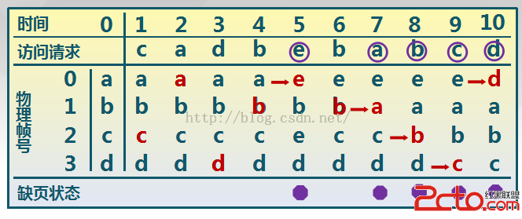
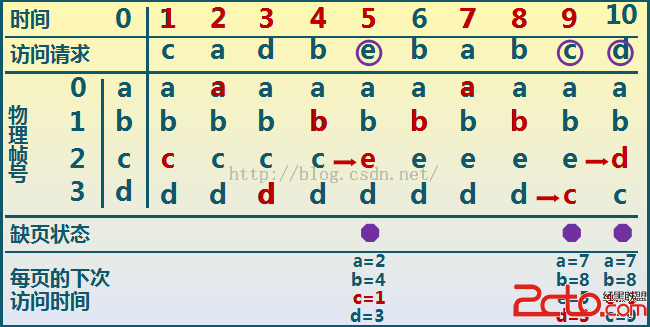
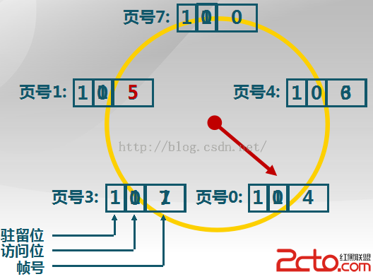

本文介绍操作系统几种常用的页面置换算法。

页面置换算法的功能：当出现缺页异常，需调入新页面而内存已满时，置换算法选择被置换的物理页面。

页面置换算法的设计目标：尽可能减少页面的调入调出次数，把未来不再访问或短期内不访问的页面调出。

# 1 最佳置换算法 (OPT)

思路：选择在内存中以后不再被访问的，或者是在最长时间内不再被访问的页面进行置换,这样可以保证获得最低的缺页率。`但由于人们目前无法预知进程在内存下的若千页面中哪个是未来最长时间内不再被访问的，因而该算法无法实现。`

最佳置换算法可以用来评价其他算法。

# 2 先进先出算法（First-In First-Out, FIFO）

思路：选择在内存驻留时间最长的页面进行置换

实现：维护一个记录所有位于内存中的逻辑页面链表，链表元素按驻留内存的时间排序，链首最长，链尾最短，出现缺页时，选择链首页面进行置换，新页面加到链尾

特点：实现简单；性能较差，调出的页面可能是经常访问的

详细的置换过程可以通过下图进行理解，图中共产生了5次缺页。

# 3 最近最久未使用算法 (Least Recently Used, LRU)

思路：选择最长时间没有被引用的页面进行置换，因为如果某些页面长时间未被访问，则它们在将来还可能会长时间不会访问

实现：缺页时，计算内存中每个逻辑页面的上一次访问时间，选择上一次使用到当前时间最长的页面

特点：可能达到最优的效果，维护这样的访问链表开销比较大

详细的置换过程见下图，图中只产生了3次缺页。

# 4 最不常用算法 (Least Frequently Used, LFU)

思路：缺页时，置换访问次数最少的页面

实现：每个页面设置一个访问计数，访问页面时，访问计数加1，缺页时，置换计数最小的页面

特点：算法开销大，开始时频繁使用，但以后不使用的页面很难置换

详细的置换过程见下图：执行在4个页帧中，假定最初的访问次数`a-＞8 b-＞5 c-＞6 d-＞2`。

# 5 时钟置换算法 (Clock)

思路：仅对页面的访问情况进行大致统计

实现：在页表项中增加访问位，描述页面在过去一段时间的内访问情况，将各页面组织成环形链表，指针指向最先调入的页面，访问页面时，在页表项记录页面访问情况，缺页时，从指针处开始顺序查找未被访问的页面进行置换

特点：时钟算法是LRU和FIFO的折中

时钟置换算法过程如下图：

>参考资料：
>
>[红黑联盟：操作系统——页面置换算法详解](http://www.2cto.com/os/201508/431266.html)
>
>[C 语言中文网：页面置换算法](http://c.biancheng.net/cpp/html/2614.html)
