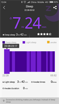
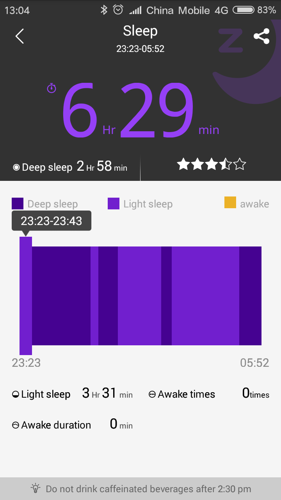
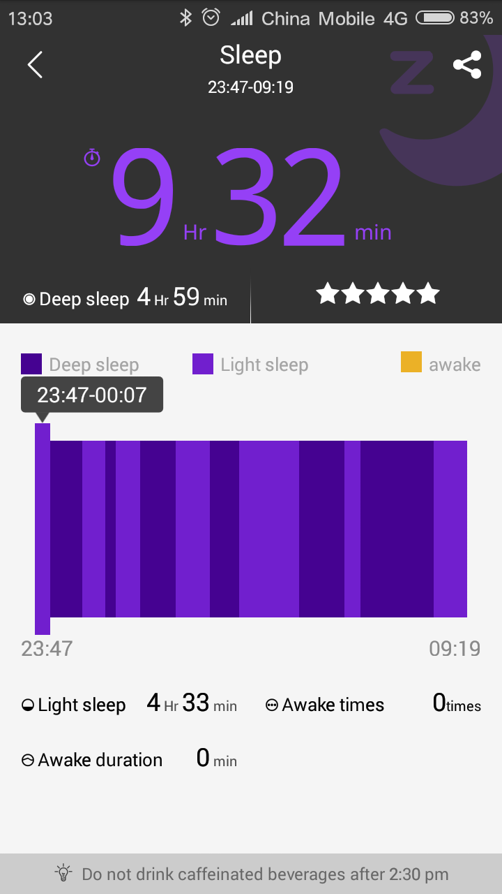
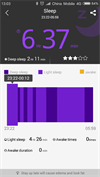
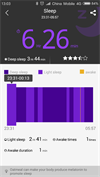
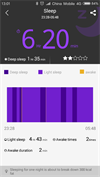
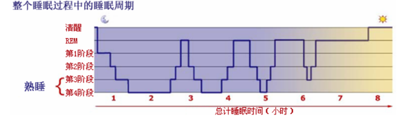
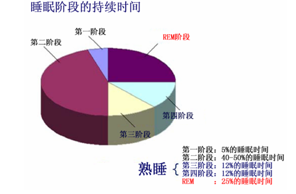
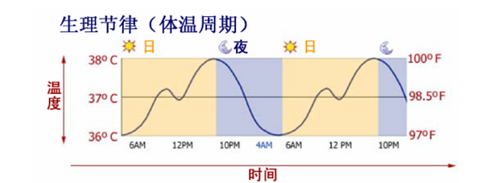
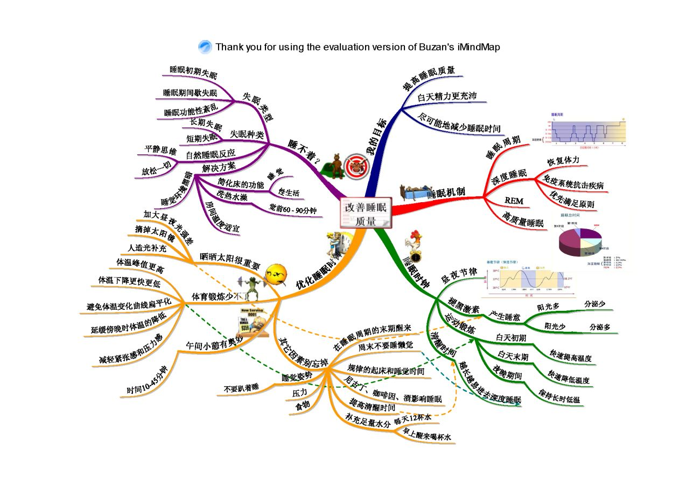

最近白天老是感觉很困，没有精神；可是每天晚上的睡眠时间也基本一致，而且最近作息时间比较规律，没有熬夜、也没起的特别早。看了看手环最近一段时间睡眠报告，就像下面这样：

 
 
 
 
 

总体来看只要睡得时间足够长，休息效果就不错，但是也有睡眠时间较少，但是休息效果却很显著的。休息效果显著的差不多都是深睡眠时间在三小时左右，不少于两个小时吧。让我感觉很惊讶的是有几天睡眠时间差不多，但是深度睡眠时间差了好多，为什么会这样呢？每天活动都差不多，睡眠时间也差不多；为什么深度睡眠的时间，会有这么大的差距呢？想到这里，我觉得要充分让自己进入深度睡眠，这样才能在有限的时间内得到充足的休息！下面我便向大家介绍下我自己整理的方法。

# 1 睡眠的奥秘

不知道你有没有这样的经历，某天晚上睡了差不多10个小时（甚至更多），第二天的精力反而比睡6小时还差？这个现象应该普遍存在，而且它是有科学依据的。下面简单介绍下，如果你非常感兴趣，你可以去读[《神奇的睡眠》](https://book.douban.com/subject/1194180/)

## 1.1 睡眠的5大阶段

1、睡眠的第一阶段（Stage 1 Sleep）呼吸和心跳频率开始轻微下降。而我们的 大脑则进入另一种创造和休息的状态，此时我们的思维如蜂蜜一般缓慢地流动——啊，这种感觉太好了。 你可以认为，睡眠的第一阶段是通向入睡之门。

2、睡眠的第二阶段大脑逐渐将其清醒时的活动停止掉。 在这一阶段，我们很容易被惊醒。（大部分上课睡觉的也是这会儿被叫醒的）

3、睡眠的第三和第四阶段（熟睡） 在睡眠的第三和第四阶段，我们的脑电波频率降到了最低。我们的血压、呼吸和心跳频率降到了一天中的最低点。 我们的血管开始扩张，平时储存在我们器官中的血液也流入到我们的肌肉中，

4、睡眠的第五阶段（REM 睡眠）快速动眼（Rapid Eye Movement），简称 REM 睡眠阶段。 在20世纪50年代，一位名叫内森·克莱特曼（Nathaniel Kleitman）的科学家发现，当人类处于这个睡眠阶段时，他们的眼球以非常快的速度向各方向运动。反常的是，这时，我们的脑电波迅速增加，而且它们变得和我们完全清醒时一模一 样！你这样想就会觉得这很合理了——在我们做梦的时候，梦境一般如此真实而生动， 以至于在我们醒来之前都不会意识到它们不是真实存在的。

晚上我们的睡眠大概这样分布：

看见了吗，在第一到第四个小时左右，你的熟睡阶段（3-4）占比是最高的，这时候梦很少。到六小时之后，就几乎是 REM 睡眠了，也就是狂做梦的阶段。这就解释了我们为什么经常早上总是在梦境中醒来的。

**当我们睡眠不规律的时候，我们的身体会以牺牲其他睡眠阶段的时间为代价，来补充 熟睡阶段的睡眠**。人们相信，这就是为什么我们的身体会在睡眠的前3到4个小时里尽可 能地熟睡。

也许你已经猜到了，高质量的睡眠就意味着容易睡熟。对于我们的大脑来说就是容 易进入熟睡阶段，并且在这个阶段停留足够的时间。

# 2 如何尽可能的提高熟睡阶段时间呢？

## 2.1 先介绍一个概念：体温节律（body temperature rhythm）

你体内的睡眠生物钟里最首要、也是最重要的部分就是你的体温节律（body temperature rhythm），也叫生理节律（circadian rhythm）。

这种周期性的体温升降告诉我们的大脑何时会感觉到累，何时会感觉更清醒些。当 我们体温升高时，我们会感觉更清醒，脑电波发射频率也更高些。当我们体温下降时， 我们会感觉到打瞌睡，身体疲乏，也会感觉很懒惰。

一般来说，我们的体温在早晨开始上升，午间有时会进行下调，然后继续上升， 直到夜晚来临。一般傍晚的时候，是我们体温的最高点，也是我们最活跃的时候。然 后体温持续下降，在凌晨4点时候达到其最低点。

那影响你体温节律的因素是什么？一些可能破坏体温节律的因素又是什么呢？ 

在我们体内的确有这样一个系统，它通过明暗来控制某种与睡眠有关的激素等级。这个激素叫褪黑素。褪黑素在我们处于黑暗中时开始分泌。当我们的眼睛停止摄入直射的阳光后，我们 体内的褪黑素含量开始升高。你体内的褪黑素含量取决于你白天眼睛所摄取的自然日光 量。你接受的阳光越多，体温下降得越慢，你也能更长时间地保持清醒警觉。若你白天 没晒多少太阳，你的体温就会下降得很快，然后你就会觉得困倦，并且无法保持平衡。 这样，你在一天中很早的时候就会想睡觉了，另外一种情况就是你就会一直不想睡觉， 从而造成失眠以及睡眠质量的降低。这也就是我们为什么要关灯睡觉的原因了。

## 2.2 介绍几个实用的提高睡眠质量的小窍门

### 2.2.1 增加你在户外的时间

阳光！增加你在户外的时间。在一间以日光灯为照明手段的办公室里，照度大约为200到500 lx，日出时，照度大约为10,000 lx。 正午太阳当空时，照度大约为100,000 lx！ 考虑到进化过程中，我们长期在光线强度很高的野外生活。而现在我们则整天呆在 日光灯下这种光线强度很低的环境中。在室内呆一天，对于我们的眼睛来说和在完全黑暗中呆一天没有什么区别！整日宅在宿舍的人因为根本感受不到阳光的变化，白天晚上基本上都差不多，所以褪黑素变化不大，体温相对恒定。正所谓爱之深，恨之切，白天不知日出眼睛鼓得溜圆，夜晚怎能安心合上双眼潇洒熟睡？ 

在家工作的人们，思考问题时别老呆在家里，赶紧打开后门到你家后院去慢慢想吧。 如果你在办公室工作，你可以把你的桌子移到窗户边上。 多计划一些户外活动。 醒来后马上掀开窗帘或其他遮光物。 在早晨和傍晚别带太阳镜。

### 2.2.2 适量运动

运动量也极为重要 你每晚的活动量和有氧运动量对你的体温节律也有着巨大的影响。任何运动锻炼都能 快速提高体温，这对你的睡眠系统很有好处。**锻炼能使你每天的峰值体温更上一层楼**。这 比其他任何一种提高体能的方法都有效。锻炼能延缓天黑后体温的下降，让你更长时间地 保持清醒警觉。最后我要说的是，锻炼能让你在一天结束时体温更迅速地下降，然后更长 时间地保持更低的温度。这能保证你能睡得更熟。 

### 2.2.3 合理安排睡眠时间 

人们的非睡眠时间（Prior Wakefulness）的总量对以上三个因素有着直 接的影响。你的活动量对你的体温变化有影响。同样，你长时间保持清醒则意味着你有 可能摄取更多的阳光，而这对你的褪黑素含量也有着直接影响。 如果你睡了8、9个小时，但白天仍觉得很困。这可能是你需要减少睡眠时间的一个信 号。你实在睡得太多了，你需要增加你的非睡眠时间，以平衡你的体温节律，让你入睡后能睡得更熟。

### 2.2.4 打盹

这里有个非常重要的小贴士，那便是中午打盹，千万不要小看它的作用。又是这张图。

看见了吗，经过了体温升高精力充沛的白天之后，到中午是个体温回落的隘口，这时通过打盹来缓解体温下降，效果是最好的。

你可能曾听人说过，小睡 10分钟就能让你重新精力充沛，就是这个道理。如果你打盹不超过45分钟，你醒来后会 感到精力充沛，准备充分。打盹的正确方式就是把时间控制得很短。这能在补充你体能的同时避免进入熟睡状 态。一些研究甚至表明，短时间打盹能把得冠心病的几率下降30%。 

但一定要切记，不要打盹过久！！！！！如果你打盹超过1到2个小时，你就非常有可能进入熟睡阶段了。你的体温开始下降，而你醒来后会感到非常困倦、丧失了判断力。同时，如果你在白天进入了熟睡阶段， 这会给你的体温节律带来沉重的打击，而到了晚上你可能很难入睡。你在晚上很难睡熟， 这又会在第二天给你带来很多负面影响，如体能不佳，头痛和恶心。然后这又会让你打更多的盹……

总结：

想睡眠效率高其实是有章可循的，简单说来，就是，在早上起床不感觉很困的前提下尽可能缩短晚上睡眠的时间，但白天一定要足够的户外活动，而且要多进行有氧或无氧的运动，保证在晚上时分精力已经耗尽快速进入睡眠。恰当时间的打盹能明显延缓体温开始下降的中午，让下午也保持体力。（如何制定夜晚该睡多久？可以通过一些实验和误差测试，来找到能让我们在睡眠周期结束后醒来的最佳 时间了。如果你醒来时感觉很糟糕，试着比你平时早起20分钟，或晚起20分钟，或晚起40 分钟。持续这样做，你最终就能找到合适的时间。）

最后分享一张大图，帮助自己改善睡眠质量：

方法在好，你不去做谁也没办法。希望你能慢慢的把这些琐碎的东西养成一种习惯。

>参考资料：
>
> [知乎：睡眠非常浅的人，该怎样改善睡眠质量？](https://www.zhihu.com/question/19575624)
>
> [知乎：怎么样能提高睡眠质量？](https://www.zhihu.com/question/20057785)
>
> [知乎：如何提高深度睡眠质量？](https://www.zhihu.com/question/21367788)