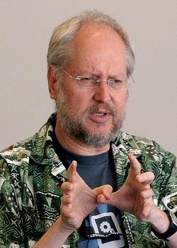

* TOC
{:toc}

首先说下开这个专栏的目的，不为别的只为督促自己学习，也为明心志；希望各位前辈和技术同仁不要误会，我本身技术还很菜，并没有意思通过任何形式去炫，只是想通过记录自己成长的过程来告诉后来人，不论你什么学校、专业，只要自己有目标，而且感兴趣，那么通过自己的努力一定会实现自己的目标的。

web 开发一直是自己喜欢的东西，自己也必将穷尽一生去追求技术上的不断提高，从前端入门、初级前端、web 开发者，最终走向梦寐以求的 web 全栈。成为了 web 全栈并不意味着我会在此止步不前，还有更让我向往的神圣职位 web 架构师，web 架构师，听听那是多么 awesome!!!!! 我觉得那才是我的人生巅峰，追求她不论花费10年，20年，还是30年，我都不会停止对技术的追求，哪怕自己已经须发皆白，就像 [道格拉斯·克罗克福德（Douglas Crockford）](http://www.ueren.com/person/view_16335.shtml) 那样。

当然我并不能和道哥相提并论，但道哥是我心中的英雄，我会努力成为像他一样的人！也非常欢迎志同道合的同学和我一起追随道哥的脚步。

下面介绍下自己所要追寻的 web 全栈的技术栈、所用的开发环境以及我是怎么样的一个人。

# 1 技术栈及开发环境

## 1.1 web 全栈工程师技术栈

- HTML5
    - https://www.w3.org/TR/html5/
- CSS3
    - https://www.w3.org/TR/CSS/
- JavaScript(jQuery.js/vue.js)
    - https://tc39.github.io/ecma262/
    - https://developer.mozilla.org/zh-CN/docs/Web/JavaScript/Reference/Global_Objects
    - https://github.com/jquery/jquery
    - https://cn.vuejs.org/
- Node.js(Express)
    - https://nodejs.org/en/
    - http://expressjs.com/
    - http://www.expressjs.com.cn/
- Mysql/MongoDB/CouchDB
    - http://www.mysql.com/
    - https://www.mongodb.com/
    - http://couchdb.apache.org/
- Shell
    - https://en.wikipedia.org/wiki/Shell_(computing)
    - http://linux.vbird.org/linux_basic/0320bash.php

- RESTful
    - https://en.wikipedia.org/wiki/Representational_state_transfer    
    - http://kb.cnblogs.com/page/512047/

## 1.2 开发环境

 - Ubuntu 16.04 LTS
    - http://www.ubuntu.org.cn/index_kylin
 - Googel Chrome Dev
    - http://www.google.com/chrome
 - 科学上网
    - https://www.google.com
  
# 2 关于我
  
## 2.1 我喜欢的话

- Stay Hungry Stay Foolish.
- 世界这么大，我想去看看。
- 世界以痛吻我，我要回报以歌。
- 你住的城市下雨了，很想问你有没有带伞。可是我忍住了，因为我怕你说没带，而我又无能为力，就像我爱你，却给不到你想要的陪伴。
- 只做自己喜欢的事，和无论做什么事都能从中发现乐趣，这是两种很了不起的能力。我们一直都在追求前一种，可是实现前一种的途径，只有后一种。

暂时只想到这么多，以后想到再来补充吧。

## 2.2 学习方法: Growth Method

- [太阁实验室：生长学习法篇（https://www.bittiger.io/channel/a3WrSoiGrNs2pcXfx）](https://www.bittiger.io/channel/a3WrSoiGrNs2pcXfx)

- [学习就像打游戏，你通关了吗？](http://mp.weixin.qq.com/s/NIpH_9bvGJnWs5ZKdjhqAA)

- [太阁实验室（Growth Method 实践者）](https://www.bittiger.io/overview)

- [鄭伊廷 (XDite)（Growth Method 实践者）](http://meco2015.innovarad.tw/xdite/)

- [李笑来（Growth Method 实践者）](http://xiaolai.li/)

# 3 写在最后

专栏终于开通啦，在这里我将记录是我怎么走向 web 全栈的，以及和大家探讨如何走向 web 全栈，也欢迎你的加入。欢迎一起学习的同学互相交流。