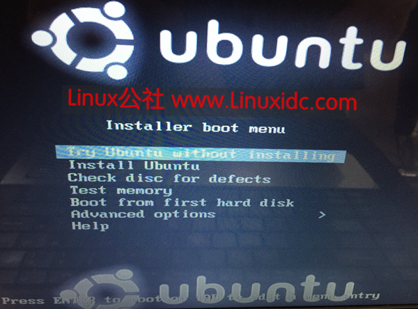
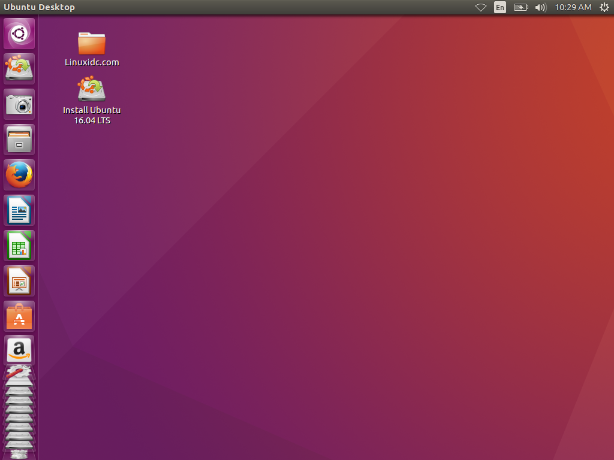
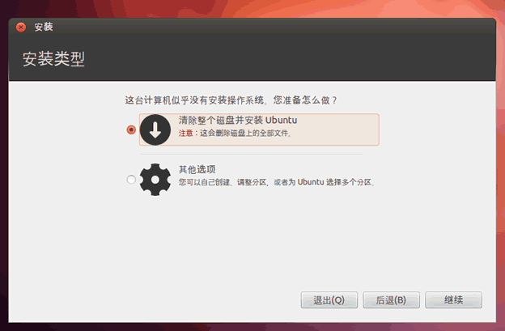
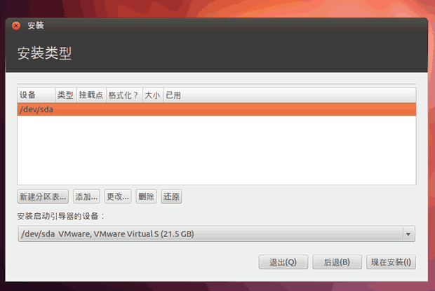
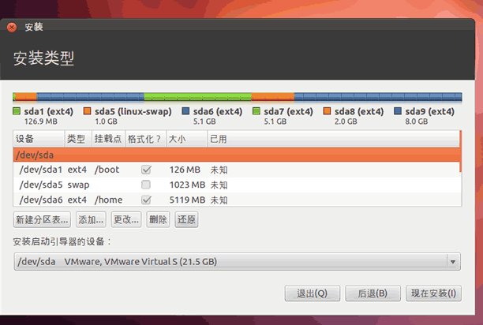

* TOC
{:toc}

上一篇文章简单介绍了下 ubuntu 的文件结构系统，这边文章将记录我安装的过程，由于安装过程中没有截图，所以本文的图片都来源网络。

# 1 制作 Ubuntu 16.04 LTS U 盘启动盘

(1) 到官网到下载 Ubuntu 16.04 LTS系统安装镜像

[https://www.ubuntu.com/download/desktop](https://www.ubuntu.com/download/desktop)

(2) 使用 UltraISO 制作 U 盘启动盘。首先插入U盘，接着使用 UltraISO 打开 Ubuntu 16.04 LTS 的 ISO 镜像，然后依次点击 UltraISO 菜单栏的“启动”"写入硬盘映像"，即可打开刻录界面，在硬盘驱动器选项中正确选择自己要制作启动盘的 U 盘，然后单击写入，最后等待刻录完成，提示刻录完成后，一个启动盘也就制作完成。

# 2 开始安装

插入 U 盘，启动计算机，根据开机提示进入 BIOS 设置 U 盘为第一启动项。稍等片刻即可进入下图所示的 Ubuntu 安装界面。

## 2.1 启动

启动后就会出现下面这个画面，选择第一选项 Try Ubuntu without installing 或 第二选项 Install Ubuntu 直接安装。。

如果不放心你的机子的硬件支持成度，可以选择 Try Ubuntu without installing 先测试下兼容性，如果没什么问题了在正式安装。

## 2.2 正式开始安装

想要正式安装就单机桌面上的 Install Ubuntu 16.04 LTS 图标开始正式安装。

## 2.3 选择语言

在这里我选择：中文（简体）

我选择安装时暂时不更新Ubuntu系统。并勾选`为图形和无线硬件，以及 MP3 和媒体安装第三方软件`，然后点击 `继续`。

## 2.4 选择安装类型

这里变牵扯到了分区、挂载等知识，下面先简单介绍下：

### 2.4.1 关于分区 

如果你只是简单地想用上 Ubuntu ，可以这样操作：

- (1）如果你是直接将整个硬盘都用来装 Ubuntu ，机器上没有需要保存的数据，或者已经做好备份的情况下，可以直接在 Ubuntu 分区时选择“向导──整个硬盘” 
- (2）如果你是做双系统，并已经在 Windows 下倒出一块空白空间（在磁盘管理中直接删除某个磁盘）。可以直接在 Ubuntu 分区时选择“向导──使用最大的连续空闲空间” 

如果想更好地理解分区并实现自我定制，看看下面的内容补习一下文件系统和挂载点的概念再根据自己的实际情况结合需求而定。

### 2.4.2 文件系统

什么是文件系统？请看 [http://man.lupaworld.com/content/other/Linux/linuxmanage/node42.html](http://man.lupaworld.com/content/other/Linux/linuxmanage/node42.html)

现在的主流文件系统就是 ReiseFS 和 [ext3](http://forum.ubuntu.org.cn/about7040.html)，你在分区时可以根据自己的需要选择一种文件系统。 

### 2.4.3 挂载点 

Linux 中分区要以文件系统的方式挂载到系统中的挂载点上，就如同 Windows 中分区也要以 Fat32 或 NTFS 格式格式化成不成的盘符一样。至少 Linux 需要一个 `/` 分区（一定要打开启动选项，好像在安装过程中直接分区时不会提示，那就不用管了），一般也都会有个 SWAP 交换分区（这东西类似 Windows 中的虚拟内存，但比那个还要专业，直接搞成一个分区形式了，而且 Linux 也有 SWAP 文件的形式出现。），当然，如果你的内存足够大，也可以不要 SWAP 分区。 

Linux 中文件系统是以`/`文件系统（根文件系统）呈树状组织起来的。

### 2.4.4 如何分区

综合网上资料我的分区方案如下：（我电脑硬盘 750 GB）

|设备         |目录	|建议大小|	格式|	描述|备注|
|:---|:---|:---|:---|:---|:---|
|/dev/sda1   |/boot	|10GB|	ext4|	|Linux的内核及引导系统程序所需要的文件，比如 vmlinuz initrd.img文件都位于这个目录中。在一般情况下，GRUB或LILO系统引导管理器也位于这个目录；启动撞在文件存放位置，如kernels，initrd，grub。|过小会造成更新 ubuntu 失败的风险|
|/dev/sad2   |swap|	8 GB|	swap|	交换空间| 机子内存 4 GB 及其以下，可以分配为内存的 2 倍，机子内存 4 GB 以上和机子内存大小相同就好|
|/dev/sda5   |/tmp	|32GB|	|ext4|	系统的临时文件，一般系统重启不会被保存。|
|/dev/sda6   |/home	|300GB|	ext4|	用户工作目录；个人配置文件，如个人环境变量等；所有账号分配一个工作目录。||
|/dev/sda7   |/	|400GB|	ext4|	用户工作目录；个人配置文件，如个人环境变量等；所有账号分配一个工作目录。||

关于分区和挂载的具体知识可以学习下面的课程，我自己就学过还是相当不错的。

- [慕课网：Linux达人养成计划 I](http://www.imooc.com/learn/175)
- [慕课网：Linux 达人养成计划 II](http://www.imooc.com/learn/111)

介绍了分区、挂载相关知识，我们接着安装。由于我是要从原来 win7 换成一个单独的 ubuntu 系统，所以就选择 `清楚整个磁盘并安装 Ubuntu` 选项，然后点击 `继续`。

# 3 分区

在这个界面按照预先规划好的分区计划，直接分区就好了。

最终分区效果如下：

最后点击现在安装，大概过半个小时左右就安装好了（等待时间长短主要看你机子的性能）。
