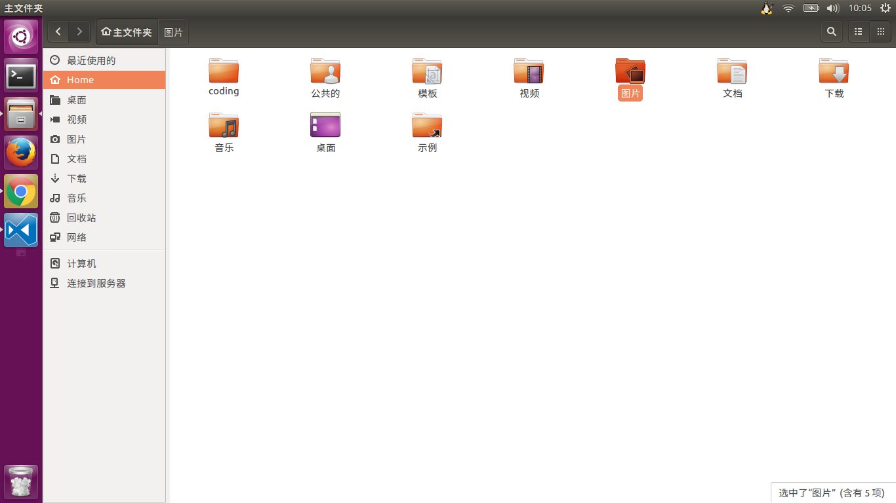

在安装 ubuntu 之前自己在网上做了点功课，又复习了下一些基础的概念，特意记录下来。这篇介绍下他的文件系统，下篇在介绍具体安装过程。

* TOC
{:toc}

# 1 文件系统类型

windows 中常见的磁盘格式有 fat16、fat32 和 ntfs 。windows 是一个封闭的系统。无法打开 ext3 或者 mac 日志式。

在 ubuntu 中其文件系统广泛使用 ext3 ( ext4 是 ext3 的扩展)的文件格式，从而实现了将整个硬盘的写入动作完整的记录在磁盘的某个区域上。如果装 windows 和 ubuntu 双系统的话，在 ubuntu 中可以实现主动挂载 windows 的文件系统，并以只读的方式访问磁盘中 windows 系统上的文件。

当你以用户的身份登录 ubuntu 系统后，可以查看自己目前所在的目录，操作及结果如下：

```bash
aidan@Aidan-Ubuntu:~$ pwd
/home/aidan
```

我的家里就是这样的，而根目录下就比较复杂了，稍后我们详细介绍。



这是我的家，关于 linux 用户的知识在这里就不在赘述，不太了解的同学可以参考：

- [慕课网：Linux达人养成计划 I](http://www.imooc.com/learn/175)
- [慕课网：Linux 达人养成计划 II](http://www.imooc.com/learn/111)

在 ubuntu 中磁盘文件系统、网络文件系统都可以非常方便的使用，而屏蔽了网络和本地之间的差异。在 ubuntu 中所有的文件都是基于目录的方式存储的。一切都是目录，一切都是文件。这本来就是 linux 所倡导的。

# 2 文件系统结构

`/` 是一切目录的起点，如大树的主干。其它的所有目录都是基于树干的枝条或者枝叶。在 ubuntu 中硬件设备如光驱、软驱、usb 设备都将挂载到这颗繁茂的枝干之下，作为文件来管理。

这里给大家先介绍一个软甲 `tree`,我用它来处理文件目录。功能很强大，安装的话很简单，使用也是比较简单的，安装完之后查看帮助就好。

```
sudo apt-get install tree // 安装 tree

tree --help // 查看 tree 使用帮助

cd / // 切到根目录

tree -L 1 // 查看跟目录下所有 1 及文件或文件夹
```

## 2.1 根目录文件结构


```
.
├── bin // bin是Binary的缩写。存放系统中最常用的可执行文件（二进制）
├── boot // 这里存放的是Linux内核和系统启动文件，包括Grub、lilo启动器程序
├── cdrom
├── dev // dev是Device(设备)的缩写。该目录存放的是Linux的外部设备，如硬盘、分区、键盘、鼠标、usb等
├── etc // 这个目录用来存放所有的系统管理所需要的配置文件和子目录，如passwd、hostname等
├── home // 用户的主目录，在Linux中，每个用户都有一个自己的目录，一般该目录名是以用户的账号命名的
├── initrd.img -> boot/initrd.img-4.4.0-21-generic
├── lib // 存放共享的库文件，包含许多被/bin和/sbin中程序使用的库文件
├── lib64
├── lost+found // 这个目录一般情况下是空的，当系统非法关机后，这里就存放了一些零散文件
├── media // ubuntu系统自动挂载的光驱、usb设备，存放临时读入的文件
├── mnt // 作为被挂载的文件系统得挂载点
├── opt // 作为可选文件和程序的存放目录，主要被第三方开发者用来简易安装和卸载他们的软件
├── proc // 这个目录是一个虚拟的目录，它是系统内存的映射，我们可以通过直接访问这个目录来获取系统信息。这里存放所有标志为文件的进程，比较cpuinfo存放cpu当前工作状态的数据
├── root // 该目录为系统管理员，也称作超级权限者的用户主目录
├── run
├── sbin // s就是Super User的意思，这里存放的是系统管理员使用的系统管理程序，如系统管理、目录查询等关键命令文件
├── snap
├── srv // 存放系统所提供的服务数据
├── sys // 系统设备和文件层次结构，并向用户程序提供详细的内核数据信息
├── tmp // 这个目录是用来存放一些临时文件的，所有用户对此目录都有读写权限
├── usr // 存放与系统用户有关的文件和目录
├── var // 长度可变的文件，尤其是些记录数据，如日志文件和打印机文件
└── vmlinuz -> boot/vmlinuz-4.4.0-21-generic
```

下面我们来具体介绍下 /var 和 /usr 目录下的内容

## 2.2 /var 和 /usr 文件结构

### 2.2.1 /var 文件结构

```
.
├── backups
├── cache // 应用程序缓存目录
├── crash // 系统错误信息
├── lib
├── local
├── lock -> /run/lock
├── log // 日志文件
├── mail // 电子邮件
├── metrics
├── opt
├── run -> /run
├── snap
├── spool
└── tmp // 临时文件目录
```

### 2.2.1 /usr 文件结构

```
.
├── bin // 应用程序和程序包的连接库
├── games // 存放着XteamLinux自带的小游戏
├── include // 用来存放Linux下开发和编译应用程序所需要的头文件，for c 或者c++
├── lib // 应用程序和程序包的连接库
├── local // 系统管理员安装的应用程序目录
├── locale
├── sbin // 存放root超级用户使用的管理程序
├── share
└── src // Linux开放的源代码
```

注: ubuntu严格区分大小写和空格，所以Sun和sun是两个不同的文件。

>
>参考资料：
>
>[poplong的专栏：ubuntu文件系统结构讲解](http://blog.csdn.net/poplong/article/details/8259386)