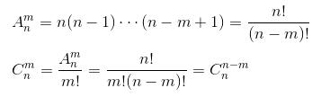
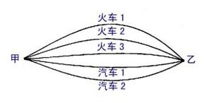
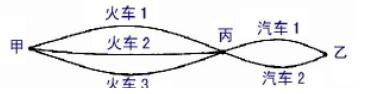

一直没能很透彻的理解排列组合，今天又回过头来温习下。在温习排列组合方法之前，先回顾一下排列组合的基本运算公式！

* TOC
{:toc}

# 1 什么是排列组合？

排列、组合的本质是研究“从n个不同的元素中，任取m (m≤n)个元素，有序和无序摆放的各种可能性”。区别排列与组合的标志是“有序”与“无序”。

## 1.1 排列 

从n个不同元素中，任取m个元素按照一定的顺序排成一列(m≤n,m与n均为自然数,下同)，叫做从n个不同元素中取出m个元素的一个排列.

从n个不同元素中取出m个元素的所有排列的个数(m≤n)，叫做从n个不同元素中取出m个元素的排列数，用符号 A(n,m）表示。

## 1.2 组合

从n个不同元素中，任取m个元素并成一组(m≤n)，叫做从n个不同元素中取出m个元素的一个组合.

从n个不同元素中取出m(m≤n）个元素的所有组合的个数，叫做从n个不同元素中取出m个元素的组合数, 用符号 C(n,m) 表示。

## 2 两种思维

解答排列、组合问题的思维模式有二：其一是看问题是有序的还是无序的？有序用“排列”，无序用“组合”；其二是看问题需要分类还是需要分步？分类用“加法”，分步用“乘法”。

## 2.1 有序与无序

没什么可说的

## 2.2 加法原理与乘法原理

加法原理：做一件事，完成它可以有n类办法，在第一类办法中有m1种不同的方法，在第二类办法中有m2种不同的方法，……，在第n类办法中有mn种不同的方法，那么完成这件事共有N=m1+m2+m3+…+mn种不同方法。

乘法原理：做一件事，完成它需要分成n个步骤，做第一步有m1种不同的方法，做第二步有m2种不同的方法，……，做第n步有mn种不同的方法，那么完成这件事共有N=m1×m2×m3×…×mn种不同的方法。

脑补：

