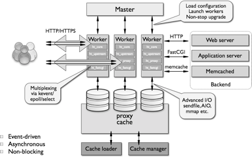

补充一点关于nginx的知识

* TOC
{:toc}

# 1 nginx 是什么？

Nginx是lgor Sysoev为俄罗斯访问量第二的rambler.ru站点设计开发的。从2004年发布至今，凭借开源的力量，已经接近成熟与完善。

Nginx功能丰富，可作为`处理高并发的HTTP服务器`，也可作为`反向代理服务器`，`邮件服务器`。支持FastCGI、SSL、Virtual Host、URL Rewrite、Gzip等功能。并且支持很多第三方的模块扩展。具有高性能、轻量级、内存消耗少，强大的负载均衡能力等优势。

Nginx的稳定性、功能集、示例配置文件和低系统资源的消耗让他后来居上，在全球活跃的网站中有12.18%的使用比率，大约为2220万个网站。

# 2 nginx 架构



如上官方示意图所示，nginx启动以后，会在系统中以daemon的方式在后台运行，其中包括一个master进程，n(n>=1)个worker进程。

其中，master进程用于接收来自外界的信号，并给worker进程发送信号，同时监控worker进程的工作状态。

worker进程则是外部请求真正的处理者，每个worker请求相互独立且平等的竞争来自客户端的请求。请求只能在一个worker进程中被处理，且一个worker进程只有一个主线程，所以同时只能处理一个请求。那么问题来了，一个worker进程只有一个主线程，只能同时处理一个请求，nginx对高并发请求强大的处理能力是如何保证的呢？答案是nginx采用`异步非阻塞`的方式来处理请求，即`单线程、非阻塞、异步IO的工作模型`。对比apache的异步非阻塞版本的工作模式，apache会为每一个请求新建一个线程去处理请求，线程进行上下文切换，会造成内存和CPU的浪费。反看**nginx的异步非阻塞io模式，实用操作系统提供的[io多路复用技术(epoll)](https://www.zhihu.com/question/28594409)，在一个线程中处理所有请求，当一个io操作开始的时候，nginx不会等待其完成就回去处理下一个请求，等到io操作完成后，nginx再回来处理这一次请求io操作的后续工作**。相比apache，nginx省去了线程上下文切换带来的资源开销。 

那么nginx如何确定哪个worker来处理请求呢？**首先，每个worker进程都是从master进程fork过来，在master进程里面，先建立好需要listen的socket（listenfd）之后，然后再fork出多个worker进程。所有worker进程的listenfd会在新连接到来时变得可读，为保证只有一个进程处理该连接，所有worker进程在注册listenfd读事件前抢accept_mutex，抢到`互斥锁`的那个进程注册listenfd读事件，在读事件里调用accept接受该连接。当一个worker进程在accept这个连接之后，就开始读取请求，解析请求，处理请求，产生数据后，再返回给客户端，最后才断开连接，这样一个完整的请求就是这样的了。这样，一个请求，完全由worker进程来处理，而且只在一个worker进程中处理。**

# 3 nginx 常用功能

## 3.1 Http代理

作为web服务器最常用的功能之一，尤其是反向代理。这里我给来2张图，对正向代理与反响代理做个诠释，具体细节，大家可以翻阅下资料。(下图的云朵可以理解为广域网)


Nginx 在做反向代理时，提供性能稳定，并且能够提供配置灵活的转发功能。Nginx可以根据不同的正则匹配，采取不同的转发策略，比如图片文件结尾的走文件服务器，动态页面走web服务器，只要你正则写的没问题，又有相对应的服务器解决方案，你就可以随心所欲的玩。并且Nginx对返回结果进行错误页跳转，异常判断等。如果被分发的服务器存在异常，他可以将请求重新转发给另外一台服务器，然后自动去除异常服务器。

## 3.2 负载均衡

通信协议支持：nginx负载均衡主要是对七层网络通信模型中的第七层应用层上的http、https进行支持。同时nginx更新版本也在逐步对Websocket、SPDY等协议作出支持。

nginx是以反向代理的方式进行负载均衡的。**反向代理（Reverse Proxy）方式是指以代理服务器来接受Internet上的连接请求，然后将请求转发给内部网络上的服务器，并将从服务器上得到的结果返回给Internet上请求连接的客户端，此时代理服务器对外就表现为一个服务器**。(为了理解反向代理，这里插播一条什么是正向代理：**正向代理指的是，一个位于客户端和原始服务器之间的服务器，为了从原始服务器取得内容，`客户端向代理发送一个请求并指定目标(原始服务器)`，然后代理向原始服务器转交请求并将获得的内容返回给客户端**。)

这里再插播一条实现负载均衡的技术的方式有哪些：硬件层面有F5负载均衡器，网络层层面有LVS(Linux Virtual Server)，应用层层面就是nginx、Haproxy等。

Nginx提供的负载均衡策略有2种：内置策略和扩展策略。内置策略为轮询，加权轮询，Ip hash。扩展策略，就天马行空，常见得有fair、url_hash等。只有你想不到的没有他做不到的啦，你可以参照所有的负载均衡算法，给他一一找出来做下实现。

### 3.2.1 轮询

- none(默认轮询): upstream按照轮询（默认）方式进行负载，每个请求按时间顺序逐一分配到不同的后端服务器，如果后端服务器down掉，能自动剔除。虽然这种方式简便、成本低廉。但缺点是：可靠性低和负载分配不均衡。

- weight(按权重轮询): 指定轮询几率，weight和访问比率成正比，用于后端服务器性能不均的情况。　

```
server 192.168.61.22 weight = 6; # 60% 请求
server 192.168.61.23 weight = 4; # 40% 请求
```


### 3.2.2 ip_hash

每个请求按访问ip的hash结果分配，这样每个访客固定访问一个后端服务器，可以解决session的问题。配置只需要在upstream中加入"ip_hash;"即可。

```
upstream tomcats {
      ip_hash;
      server 127.0.0.1:9001;
      server 127.0.0.1:9002;
}
```


### 3.2.3 fair(第三方)

按后端服务器的响应时间来分配请求，响应时间短的优先分配。与weight分配策略类似。

```
upstream tomcats {
      server 127.0.0.1:9001;
      server 127.0.0.1:9002;
      fair;
}
```

### 3.2.4 url_hash(第三方)

和IP哈希类似，只不过针对请求的url进行hash（基于缓存的server，页面静态化）。

## 4 web缓存

Nginx可以对不同的文件做不同的缓存处理，配置灵活，并且支持FastCGI_Cache，主要用于对FastCGI的动态程序进行缓存。配合着第三方的ngx_cache_purge，对制定的URL缓存内容可以的进行增删管理。

# 5 nginx 的性能

这里援引网上搜索到的nginx的测试数据：10000个非活跃的HTTP keep-alive 连接仅占用约2.5MB内存。三万并发连接下，10个Nginx进程，消耗内存150M。淘宝tengine团队说测试结果是“24G内存机器上，处理并发请求可达200万”

# 6 nginx 配置文件详解

```bash
######Nginx配置文件nginx.conf中文详解#####

#定义Nginx运行的用户和用户组
user www www;

#nginx进程数，建议设置为等于CPU总核心数。
worker_processes 8;
 
#全局错误日志定义类型，[ debug | info | notice | warn | error | crit ]
error_log /usr/local/nginx/logs/error.log info;

#进程pid文件
pid /usr/local/nginx/logs/nginx.pid;

#指定进程可以打开的最大描述符：数目
#工作模式与连接数上限
#这个指令是指当一个nginx进程打开的最多文件描述符数目，理论值应该是最多打开文件数（ulimit -n）与nginx进程数相除，但是nginx分配请求并不是那么均匀，所以最好与ulimit -n 的值保持一致。
#现在在linux 2.6内核下开启文件打开数为65535，worker_rlimit_nofile就相应应该填写65535。
#这是因为nginx调度时分配请求到进程并不是那么的均衡，所以假如填写10240，总并发量达到3-4万时就有进程可能超过10240了，这时会返回502错误。
worker_rlimit_nofile 65535;


events
{
    #参考事件模型，use [ kqueue | rtsig | epoll | /dev/poll | select | poll ]; epoll模型
    #是Linux 2.6以上版本内核中的高性能网络I/O模型，linux建议epoll，如果跑在FreeBSD上面，就用kqueue模型。
    #补充说明：
    #与apache相类，nginx针对不同的操作系统，有不同的事件模型
    #A）标准事件模型
    #Select、poll属于标准事件模型，如果当前系统不存在更有效的方法，nginx会选择select或poll
    #B）高效事件模型
    #Kqueue：使用于FreeBSD 4.1+, OpenBSD 2.9+, NetBSD 2.0 和 MacOS X.使用双处理器的MacOS X系统使用kqueue可能会造成内核崩溃。
    #Epoll：使用于Linux内核2.6版本及以后的系统。
    #/dev/poll：使用于Solaris 7 11/99+，HP/UX 11.22+ (eventport)，IRIX 6.5.15+ 和 Tru64 UNIX 5.1A+。
    #Eventport：使用于Solaris 10。 为了防止出现内核崩溃的问题， 有必要安装安全补丁。
    use epoll;

    #单个进程最大连接数（最大连接数=连接数*进程数）
    #根据硬件调整，和前面工作进程配合起来用，尽量大，但是别把cpu跑到100%就行。每个进程允许的最多连接数，理论上每台nginx服务器的最大连接数为。
    worker_connections 65535;

    #keepalive超时时间。
    keepalive_timeout 60;

    #客户端请求头部的缓冲区大小。这个可以根据你的系统分页大小来设置，一般一个请求头的大小不会超过1k，不过由于一般系统分页都要大于1k，所以这里设置为分页大小。
    #分页大小可以用命令getconf PAGESIZE 取得。
    #[root@web001 ~]# getconf PAGESIZE
    #4096
    #但也有client_header_buffer_size超过4k的情况，但是client_header_buffer_size该值必须设置为“系统分页大小”的整倍数。
    client_header_buffer_size 4k;

    #这个将为打开文件指定缓存，默认是没有启用的，max指定缓存数量，建议和打开文件数一致，inactive是指经过多长时间文件没被请求后删除缓存。
    open_file_cache max=65535 inactive=60s;

    #这个是指多长时间检查一次缓存的有效信息。
    #语法:open_file_cache_valid time 默认值:open_file_cache_valid 60 使用字段:http, server, location 这个指令指定了何时需要检查open_file_cache中缓存项目的有效信息.
    open_file_cache_valid 80s;

    #open_file_cache指令中的inactive参数时间内文件的最少使用次数，如果超过这个数字，文件描述符一直是在缓存中打开的，如上例，如果有一个文件在inactive时间内一次没被使用，它将被移除。
    #语法:open_file_cache_min_uses number 默认值:open_file_cache_min_uses 1 使用字段:http, server, location  这个指令指定了在open_file_cache指令无效的参数中一定的时间范围内可以使用的最小文件数,如果使用更大的值,文件描述符在cache中总是打开状态.
    open_file_cache_min_uses 1;
    
    #语法:open_file_cache_errors on | off 默认值:open_file_cache_errors off 使用字段:http, server, location 这个指令指定是否在搜索一个文件是记录cache错误.
    open_file_cache_errors on;
}
 
 
 
#设定http服务器，利用它的反向代理功能提供负载均衡支持
http
{
    #文件扩展名与文件类型映射表
    include mime.types;

    #默认文件类型
    default_type application/octet-stream;

    #默认编码
    #charset utf-8;

    #服务器名字的hash表大小
    #保存服务器名字的hash表是由指令server_names_hash_max_size 和server_names_hash_bucket_size所控制的。参数hash bucket size总是等于hash表的大小，并且是一路处理器缓存大小的倍数。在减少了在内存中的存取次数后，使在处理器中加速查找hash表键值成为可能。如果hash bucket size等于一路处理器缓存的大小，那么在查找键的时候，最坏的情况下在内存中查找的次数为2。第一次是确定存储单元的地址，第二次是在存储单元中查找键 值。因此，如果Nginx给出需要增大hash max size 或 hash bucket size的提示，那么首要的是增大前一个参数的大小.
    server_names_hash_bucket_size 128;

    #客户端请求头部的缓冲区大小。这个可以根据你的系统分页大小来设置，一般一个请求的头部大小不会超过1k，不过由于一般系统分页都要大于1k，所以这里设置为分页大小。分页大小可以用命令getconf PAGESIZE取得。
    client_header_buffer_size 32k;

    #客户请求头缓冲大小。nginx默认会用client_header_buffer_size这个buffer来读取header值，如果header过大，它会使用large_client_header_buffers来读取。
    large_client_header_buffers 4 64k;

    #设定通过nginx上传文件的大小
    client_max_body_size 8m;

    #开启高效文件传输模式，sendfile指令指定nginx是否调用sendfile函数来输出文件，对于普通应用设为 on，如果用来进行下载等应用磁盘IO重负载应用，可设置为off，以平衡磁盘与网络I/O处理速度，降低系统的负载。注意：如果图片显示不正常把这个改成off。
    #sendfile指令指定 nginx 是否调用sendfile 函数（zero copy 方式）来输出文件，对于普通应用，必须设为on。如果用来进行下载等应用磁盘IO重负载应用，可设置为off，以平衡磁盘与网络IO处理速度，降低系统uptime。
    sendfile on;

    #开启目录列表访问，合适下载服务器，默认关闭。
    autoindex on;

    #此选项允许或禁止使用socke的TCP_CORK的选项，此选项仅在使用sendfile的时候使用
    tcp_nopush on;
     
    tcp_nodelay on;

    #长连接超时时间，单位是秒
    keepalive_timeout 120;

    #FastCGI相关参数是为了改善网站的性能：减少资源占用，提高访问速度。下面参数看字面意思都能理解。
    fastcgi_connect_timeout 300;
    fastcgi_send_timeout 300;
    fastcgi_read_timeout 300;
    fastcgi_buffer_size 64k;
    fastcgi_buffers 4 64k;
    fastcgi_busy_buffers_size 128k;
    fastcgi_temp_file_write_size 128k;

    #gzip模块设置
    gzip on; #开启gzip压缩输出
    gzip_min_length 1k;    #最小压缩文件大小
    gzip_buffers 4 16k;    #压缩缓冲区
    gzip_http_version 1.0;    #压缩版本（默认1.1，前端如果是squid2.5请使用1.0）
    gzip_comp_level 2;    #压缩等级
    gzip_types text/plain application/x-javascript text/css application/xml;    #压缩类型，默认就已经包含textml，所以下面就不用再写了，写上去也不会有问题，但是会有一个warn。
    gzip_vary on;

    #开启限制IP连接数的时候需要使用
    #limit_zone crawler $binary_remote_addr 10m;


    #负载均衡配置
    upstream piao.jd.com {
     
        #upstream的负载均衡，weight是权重，可以根据机器配置定义权重。weigth参数表示权值，权值越高被分配到的几率越大。
        server 192.168.80.121:80 weight=3;
        server 192.168.80.122:80 weight=2;
        server 192.168.80.123:80 weight=3;

        #nginx的upstream目前支持4种方式的分配
        #1、轮询（默认）
        #每个请求按时间顺序逐一分配到不同的后端服务器，如果后端服务器down掉，能自动剔除。
        #2、weight
        #指定轮询几率，weight和访问比率成正比，用于后端服务器性能不均的情况。
        #例如：
        #upstream bakend {
        #    server 192.168.0.14 weight=10;
        #    server 192.168.0.15 weight=10;
        #}
        #2、ip_hash
        #每个请求按访问ip的hash结果分配，这样每个访客固定访问一个后端服务器，可以解决session的问题。
        #例如：
        #upstream bakend {
        #    ip_hash;
        #    server 192.168.0.14:88;
        #    server 192.168.0.15:80;
        #}
        #3、fair（第三方）
        #按后端服务器的响应时间来分配请求，响应时间短的优先分配。
        #upstream backend {
        #    server server1;
        #    server server2;
        #    fair;
        #}
        #4、url_hash（第三方）
        #按访问url的hash结果来分配请求，使每个url定向到同一个后端服务器，后端服务器为缓存时比较有效。
        #例：在upstream中加入hash语句，server语句中不能写入weight等其他的参数，hash_method是使用的hash算法
        #upstream backend {
        #    server squid1:3128;
        #    server squid2:3128;
        #    hash $request_uri;
        #    hash_method crc32;
        #}

        #tips:
        #upstream bakend{#定义负载均衡设备的Ip及设备状态}{
        #    ip_hash;
        #    server 127.0.0.1:9090 down;
        #    server 127.0.0.1:8080 weight=2;
        #    server 127.0.0.1:6060;
        #    server 127.0.0.1:7070 backup;
        #}
        #在需要使用负载均衡的server中增加 proxy_pass http://bakend/;

        #每个设备的状态设置为:
        #1.down表示单前的server暂时不参与负载
        #2.weight为weight越大，负载的权重就越大。
        #3.max_fails：允许请求失败的次数默认为1.当超过最大次数时，返回proxy_next_upstream模块定义的错误
        #4.fail_timeout:max_fails次失败后，暂停的时间。
        #5.backup： 其它所有的非backup机器down或者忙的时候，请求backup机器。所以这台机器压力会最轻。

        #nginx支持同时设置多组的负载均衡，用来给不用的server来使用。
        #client_body_in_file_only设置为On 可以讲client post过来的数据记录到文件中用来做debug
        #client_body_temp_path设置记录文件的目录 可以设置最多3层目录
        #location对URL进行匹配.可以进行重定向或者进行新的代理 负载均衡
    }
     
     
     
    #虚拟主机的配置
    server
    {
        #监听端口
        listen 80;

        #域名可以有多个，用空格隔开
        server_name www.jd.com jd.com;
        index index.html index.htm index.php;
        root /data/www/jd;

        #对******进行负载均衡
        location ~ .*.(php|php5)?$
        {
            fastcgi_pass 127.0.0.1:9000;
            fastcgi_index index.php;
            include fastcgi.conf;
        }
         
        #图片缓存时间设置
        location ~ .*.(gif|jpg|jpeg|png|bmp|swf)$
        {
            expires 10d;
        }
         
        #JS和CSS缓存时间设置
        location ~ .*.(js|css)?$
        {
            expires 1h;
        }
         
        #日志格式设定
        #$remote_addr与$http_x_forwarded_for用以记录客户端的ip地址；
        #$remote_user：用来记录客户端用户名称；
        #$time_local： 用来记录访问时间与时区；
        #$request： 用来记录请求的url与http协议；
        #$status： 用来记录请求状态；成功是200，
        #$body_bytes_sent ：记录发送给客户端文件主体内容大小；
        #$http_referer：用来记录从那个页面链接访问过来的；
        #$http_user_agent：记录客户浏览器的相关信息；
        #通常web服务器放在反向代理的后面，这样就不能获取到客户的IP地址了，通过$remote_add拿到的IP地址是反向代理服务器的iP地址。反向代理服务器在转发请求的http头信息中，可以增加x_forwarded_for信息，用以记录原有客户端的IP地址和原来客户端的请求的服务器地址。
        log_format access '$remote_addr - $remote_user [$time_local] "$request" '
        '$status $body_bytes_sent "$http_referer" '
        '"$http_user_agent" $http_x_forwarded_for';
         
        #定义本虚拟主机的访问日志
        access_log  /usr/local/nginx/logs/host.access.log  main;
        access_log  /usr/local/nginx/logs/host.access.404.log  log404;
         
        #对 "/" 启用反向代理
        location / {
            proxy_pass http://127.0.0.1:88;
            proxy_redirect off;
            proxy_set_header X-Real-IP $remote_addr;
             
            #后端的Web服务器可以通过X-Forwarded-For获取用户真实IP
            proxy_set_header X-Forwarded-For $proxy_add_x_forwarded_for;
             
            #以下是一些反向代理的配置，可选。
            proxy_set_header Host $host;

            #允许客户端请求的最大单文件字节数
            client_max_body_size 10m;

            #缓冲区代理缓冲用户端请求的最大字节数，
            #如果把它设置为比较大的数值，例如256k，那么，无论使用firefox还是IE浏览器，来提交任意小于256k的图片，都很正常。如果注释该指令，使用默认的client_body_buffer_size设置，也就是操作系统页面大小的两倍，8k或者16k，问题就出现了。
            #无论使用firefox4.0还是IE8.0，提交一个比较大，200k左右的图片，都返回500 Internal Server Error错误
            client_body_buffer_size 128k;

            #表示使nginx阻止HTTP应答代码为400或者更高的应答。
            proxy_intercept_errors on;

            #后端服务器连接的超时时间_发起握手等候响应超时时间
            #nginx跟后端服务器连接超时时间(代理连接超时)
            proxy_connect_timeout 90;

            #后端服务器数据回传时间(代理发送超时)
            #后端服务器数据回传时间_就是在规定时间之内后端服务器必须传完所有的数据
            proxy_send_timeout 90;

            #连接成功后，后端服务器响应时间(代理接收超时)
            #连接成功后_等候后端服务器响应时间_其实已经进入后端的排队之中等候处理（也可以说是后端服务器处理请求的时间）
            proxy_read_timeout 90;

            #设置代理服务器（nginx）保存用户头信息的缓冲区大小
            #设置从被代理服务器读取的第一部分应答的缓冲区大小，通常情况下这部分应答中包含一个小的应答头，默认情况下这个值的大小为指令proxy_buffers中指定的一个缓冲区的大小，不过可以将其设置为更小
            proxy_buffer_size 4k;

            #proxy_buffers缓冲区，网页平均在32k以下的设置
            #设置用于读取应答（来自被代理服务器）的缓冲区数目和大小，默认情况也为分页大小，根据操作系统的不同可能是4k或者8k
            proxy_buffers 4 32k;

            #高负荷下缓冲大小（proxy_buffers*2）
            proxy_busy_buffers_size 64k;

            #设置在写入proxy_temp_path时数据的大小，预防一个工作进程在传递文件时阻塞太长
            #设定缓存文件夹大小，大于这个值，将从upstream服务器传
            proxy_temp_file_write_size 64k;
        }
         
         
        #设定查看Nginx状态的地址
        location /NginxStatus {
            stub_status on;
            access_log on;
            auth_basic "NginxStatus";
            auth_basic_user_file confpasswd;
            #htpasswd文件的内容可以用apache提供的htpasswd工具来产生。
        }
         
        #本地动静分离反向代理配置
        #所有jsp的页面均交由tomcat或resin处理
        location ~ .(jsp|jspx|do)?$ {
            proxy_set_header Host $host;
            proxy_set_header X-Real-IP $remote_addr;
            proxy_set_header X-Forwarded-For $proxy_add_x_forwarded_for;
            proxy_pass http://127.0.0.1:8080;
        }
         
        #所有静态文件由nginx直接读取不经过tomcat或resin
        location ~ .*.(htm|html|gif|jpg|jpeg|png|bmp|swf|ioc|rar|zip|txt|flv|mid|doc|ppt|
        pdf|xls|mp3|wma)$
        {
            expires 15d; 
        }
         
        location ~ .*.(js|css)?$
        {
            expires 1h;
        }
    }
}
######Nginx配置文件nginx.conf中文详解#####
```

>
>参考资料：
>
>[负载均衡——nginx理论](http://www.cnblogs.com/ivehd/archive/2016/11/13/nginxSummary.html)
>
>[Nginx配置文件详解](http://www.cnblogs.com/hunttown/p/5759959.html)
>
>[Nginx配置详解](http://www.cnblogs.com/knowledgesea/p/5175711.html)
>
>[进阶：Nginx介绍](http://blog.csdn.net/hanhuili/article/details/9389571)
>
