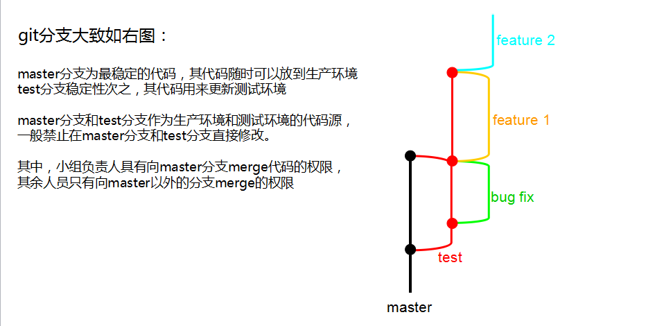
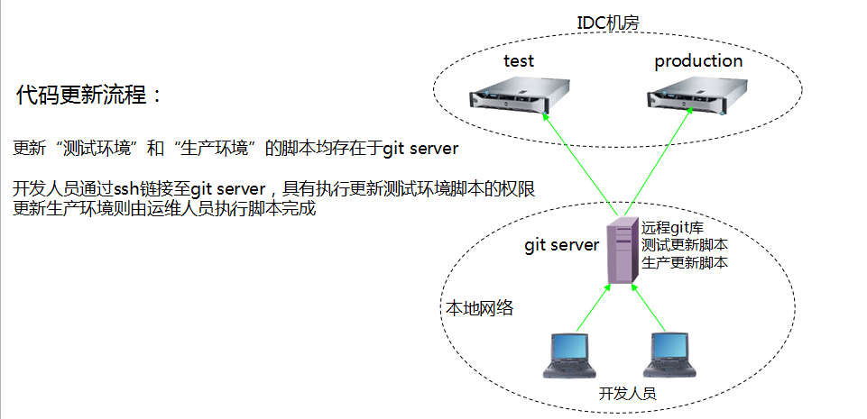

本文简单介绍下 git + rsync 的项目部署流程

* TOC
{:toc}

web服务器A，源码(git)服务器B，从B将最新push的代码复制到web服务器A，使用rsync复制，由于在copy过程中，从dev代码到生产的代码其中必然有一些微小的变化，比如数据库配置等信息是不需要变更的，文件的所属和权限有变化。基于这个需求，设计由开发人员提交一个shell脚本，git服务器在hook里面调用这个脚本deploy.sh。当然git服务器的原始hook脚本，在调用deploy.sh前后需要进行一些基本的现场搭建和清理工作。另外web服务器A和git服务器B都需要安装rsync，A上的rsync以服务端模式工作，配置开机自启动，文件推送时需要认证。

