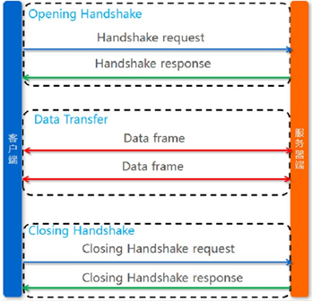
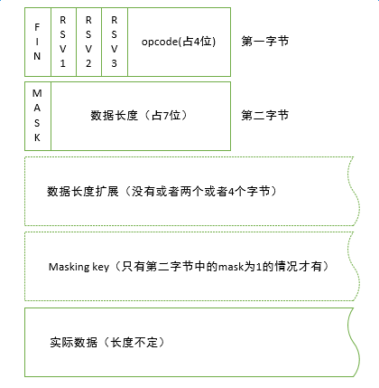

首先我们来看看什么是 WebSocket, 下面是引用自 wikipedia 的定义：

>WebSocket 是一种通过单个 TCP 连接提供全双工通讯的计算机通信协议。WebSocket 协议在2011年由 IETF 标准化为 [RFC 6455](https://tools.ietf.org/html/rfc6455)，并且 WebSocket API 也被 W3C 定为标准。

> WebSocket 是一种不同于 HTTP 的应用层协议。WebSocket 和 HTTP 协议都位于 [OSI 模型](https://en.wikipedia.org/wiki/OSI_model)的第7层，因此都依赖于第4层的 TCP 协议。尽管它们不同，但 RFC 6455 规定 WebSocket 被设计为通过HTTP 的80和443端口工作，以及支持 HTTP 代理和中介，从而使其与 HTTP 协议兼容。为了实现可靠性，WebSocket 握手使用 [HTTP Upgrade header](https://en.wikipedia.org/wiki/HTTP/1.1_Upgrade_header) 从 HTTP 协议更改为 WebSocket 协议。

>WebSocket 协议支持浏览器和 Web 服务器之间的交互，具有较低的开销，便于从服务器进行实时数据传输。这可以通过提供标准化的方式使服务器将内容发送到浏览器而不被客户端请求，并允许在保持连接打开的同时传递消息。以这种方式，可以在浏览器和服务器之间进行全双工通讯。

通过上面的介绍我们知道 WebSocket 是一种应用层协议，支持全双工通信。但它与 HTTP 有什么关系，以及是怎么实现全双工通信的呢？等等问题。接下来我们主要通过简单的介绍 WebSocket 协议来解答这些疑惑。

* TOC
{:toc}


# 1 WebSocket URI

```
ws-URI = "ws:" "//" host [ ":" port ] path [ "?" query ]
wss-URI = "wss:" "//" host [ ":" port ] path [ "?" query ]

host = <host, defined in [RFC3986], Section 3.2.2>
port = <port, defined in [RFC3986], Section 3.2.3>
path = <path-abempty, defined in [RFC3986], Section 3.3>
query = <query, defined in [RFC3986], Section 3.4>
```

# 2 打开阶段握手

一个典型的 WebSocket 握手请求如下：

客户端请求

```
GET /chat HTTP/1.1
Host: server.example.com
Upgrade: WebSocket
Connection: Upgrade
Sec-WebSocket-Key: dGhlIHNhbXBsZSBub25jZQ==
Origin: http://example.com
Sec-WebSocket-Protocol: chat, superchat
Sec-WebSocket-Version: 13
```

服务器响应

```
HTTP/1.1 101 Switching Protocols
Upgrade: WebSocket
Connection: Upgrade
Sec-WebSocket-Accept: s3pPLMBiTxaQ9kYGzzhZRbK+xOo=
Sec-WebSocket-Protocol: chat
```

(1) Upgrade 表示的意思是：客户端准备使用 WebSocket 协议进行通讯，服务端如果支持的话，咱们就换 WebSocket 协议吧！

(2) Sec-WebSocket-Key 是一种验证服务端是不是只是 WebSocket 的验证算法。与服务器端响应中的 Sec-WebSocket-Accept 是对应的。

(3) Sec-WebSocket-Protocol 头字段用于 WebSocket 打开握手。它从客户端发送到服务器，并从服务器返回到客户端，以确认连接的子协议。 这使脚本能够选择子协议，并确保服务器同意服务该子协议。

(4) Sec-WebSocket-Version 是指浏览器支持的 WebSocket 版本号。需要注意的是这里不会出现9~12的版本号，因为 WebSocket 协议规定 9~12 是保留字。

(5) Sec-WebSocket-Accept 与 Sec-WebSocket-Key 的对应算法是：

```
Sec-WebSocket-Accept = base64(
    hash1(
        Sec-WebSocket-Key + 258EAFA5-E914-47DA-95CA-C5AB0DC85B11
    )
)
```

如果返回的 Sec-WebSocket-Accept 不对，在 chrome 下会出现 Sec-WebSocket-Accept dismatch 的错误。

(6) HTTP Status: Response 返回的是 101 , 代表服务器端说 ”我们双方后面就按照 webscoket 协议来进行数据传输吧“。

(7) Sec-WebSocket-Extensions 头字段用于 WebSocket 打开握手。 它最初从客户端发送到服务器，然后从服务器发送到客户端，以商定在连接期间使用的一组协议级扩展。

上面介绍了 WebSocket 握手阶段的一些头字段，我们显然也能看出来他还是 HTTP 请求。握手还是经典的三次握手，在这里就不在讨论了。WebSocket 的建立总结如下：

- 客户端浏览器首先要向服务器发起一个 HTTP 请求，然后等待服务器响应。需要说明的是：这个请求和通常的 HTTP 请求不同，包含了一些附加头信息，其中附加头信息 ”Upgrade: WebSocket“ 表明这是一个申请协议升级的 HTTP 请求。
- 服务器解析这些附加的头信息，然后返回握手响应，告诉浏览器将后续的数据按照 WebSocket 协议指定的数据格式传过来。此时，客户端和服务器端的 WebSocket 连接就建立起来了。
- 客户端和服务器端有任何需要传递的数据时，可以通过这个连接通道自由的传递信息。
- 这个连接会持续存在，直到客户端或服务器的某一方主动关闭连接。

整个流程如下图：



# 3 数据帧

在 WebSocket 协议中，数据通过帧序列来传输。 为避免混淆网络中间件（例如拦截代理）和出于安全原因，客户端必须掩码（mask）它发送到服务器的所有帧（注意不管 WebSocket 协议是否运行在 TLS 至上，掩码都要做。） 当收到一个没有掩码的帧时，服务器必须关闭连接。 在这种情况下，服务器可能发送状态码 1002（协议错误）的Close 帧。 服务器必须不掩码发送到客户端的所有帧。 如果客户端检测到掩码的帧，它必须关闭连接。 在这种情况下，它可能发送状态码1002（协议错误）。

[基本帧协议](https://chenjianlong.gitbooks.io/rfc-6455-websocket-protocol-in-chinese/content/section5/section5.html)定义了带有操作码（opcode）的帧类型、负载长度、和用于“扩展数据”与“应用数据”及它们一起定义的“负载数据”的指定位置。 某些字节和操作码保留用于未来协议的扩展。

一个数据帧可以被客户端或者服务器在打开阶段握手完成之后和端点发送 Close 帧之前的任何时候传输。

## 3.1 基本帧协议

```
  0                   1                   2                   3
  0 1 2 3 4 5 6 7 8 9 0 1 2 3 4 5 6 7 8 9 0 1 2 3 4 5 6 7 8 9 0 1
 +-+-+-+-+-------+-+-------------+-------------------------------+
 |F|R|R|R| opcode|M| Payload len |    Extended payload length    |
 |I|S|S|S|  (4)  |A|     (7)     |             (16/64)           |
 |N|V|V|V|       |S|             |   (if payload len==126/127)   |
 | |1|2|3|       |K|             |                               |
 +-+-+-+-+-------+-+-------------+ - - - - - - - - - - - - - - - +
 |     Extended payload length continued, if payload len == 127  |
 + - - - - - - - - - - - - - - - +-------------------------------+
 |                               |Masking-key, if MASK set to 1  |
 +-------------------------------+-------------------------------+
 | Masking-key (continued)       |          Payload Data         |
 +-------------------------------- - - - - - - - - - - - - - - - +
 :                     Payload Data continued ...                :
 + - - - - - - - - - - - - - - - - - - - - - - - - - - - - - - - +
 |                     Payload Data continued ...                |
 +---------------------------------------------------------------+
```




- FIN(1 bit): 是否为消息的最后一个数据帧
- RSV1, RSV2, RSV3(每个1 bit): 必须是0，除非一个扩展协商为非零值定义含义。
- Opcode(4 bits): 定义了“负载数据”的解释（这4位转为16进制值表示的意思如下）
    - %x0 代表一个继续帧
    - %x1 代表一个文本帧
    - %x2 代表一个二进制帧
    - %x3～7 保留用于未来的非控制帧
    - %x8 代表连接关闭
    - %x9 代表ping
    - %xA 代表pong
    - %xB～F 保留用于未来的控制帧
- Mask(1 bit): 定义 “负载数据”是否是经过掩码的。
- Payload length(7 bits, 7 + 16 bits, 或者 7+64 bits): 定义  “负载数据”的长度，以字节为单位。
    - a. 如果数据长度小于等于125，那么该7位用来表示实际数据长度。
    - b. 如果数据长度为126到65535(65535 = 1111111111111111)之间，该7位的值固定为126，也就是1111110。往后扩展两个字节（16位，第三个区块）用于存储实际数据长度。
    - c. 如果数据长度大于65535，该7位的值固定为127，也就是1111111。往后扩展8个字节（64位，第三个区块）用于存储实际数据长度。
- Masking-key(0 or 4 bytes): 该区块用于存储掩码密钥（masking key），只有在第二字节中的mask为1，也就是消息进行了掩码处理时才有，否则没有。所以服务端向客户端发送消息就没有这块。
- Payload data [ (x+y) bytes ]: “负载数据”定义为“扩展数据”连接“应用数据”。
    - Extension data(x bytes): “扩展数据”是 0 字节除非已经协商了一个扩展。 任何扩展必须指定“扩展数据”的长度，或长度是如何计算的，以及扩展如何使用必须在打开阶段握手期间协商。 如果存在，“扩展数据”包含在总负载长度中。
    - Application data(y bytes): 任意的“应用数据”，占用“扩展数据”之后帧的剩余部分。 “应用数据”的长度等于负载数据长度减去“扩展数据”长度。

## 3.2 客户端到服务器掩码

从浏览器向服务器发送的 WebSocket 帧在实际内容之前还有一个 4字节的掩码，这是为了不常见的安全原因，以及改进与现有 HTTP 代理的兼容性。

WebSocket 协议要求客户端所发送的帧必需掩码，帧头在第二个字节的第一位表示该帧是否使用了掩码。

WebSocket 服务器接收的每个载荷在处理之前首先需要处理掩码，解除掩码之后，服务器将得到原始消息内容。二进制消息可以直接交付，文本消息将进行 UTF-8 解码并输出到字符串中。

没理解，可以讨论下？

[Websocket为什么在客户端向服务端发送报文的时候需要掩码加密，而服务端向客户端不需要呢？](https://www.zhihu.com/question/40019896)

## 3.3 分片（Fragmentation）

分片的主要目的是允许当发送一个未知大小的消息时可以直接开始而不用缓存那条消息。如果消息不能被分片，那么端点将不得不缓冲整个消息以便在首字节发送之前统计出它的长度。对于分片，服务器或中间件可以选择一个合适大小的缓冲，当缓冲满时，写一个片段到网络。 

第二个分片的用例是用于多路复用，一个逻辑通道上的一个大消息独占输出通道是不可取的，因此多路复用需要可以分割消息为更小的分段来更好的共享输出通道。

## 3.4 控制帧

控制帧用于传达有关 WebSocket 的状态。 控制帧可以插入到分片消息的中间。

- Close
- Ping
- Pong

当收到一个 Ping 帧时，一个端点必须在响应中发送一个Pong帧，除非它早已接收到一个关闭帧。 它应该尽可能快地以 Pong 帧响应。

一个端点可以在连接建立之后并在连接关闭之前的任何时候发送一个 Ping 帧(一个 Ping 即可以充当一个 keepalive，也可以作为验证远程端点仍可响应的手段)。

## 3.5 数据帧

数据帧由操作码最高位是0的操作码标识。当前为数据帧定义的操作码包括0x1(文本)、0x2（二进制）。

## 3.6 可扩展性

协议被设计为允许扩展，这将增加功能到基础协议。 端点的一个连接必须在打开阶段握手期间协商使用的任何扩展。

# 4 发送和接收数据

## 4.1 发送数据

为了发送一个 WebSocket 消息，端点必须执行以下步骤:

- 端点必须确保 WebSocket 连接处于 OPEN 状态。 如果在任何时刻WebSocket连接的状态改变了，端点必须终止以下步骤。
- 端点必须封装数据到一个 WebSocket 帧。如果要发送的数据太大，或如果在端点想要开始发生数据时数据作为一个整体不可用，端点可以按照基本帧协议交替地封装数据到一系列的帧中。
- 第一个包含数据的帧的操作码（帧-opcode）必须按照基本帧协议被设置为适当的值用于接收者解释数据是文本还是二进制数据。
- 包含数据的最后帧的 FIN 位（帧-fin）必须基本帧协议的定义设置为 1
- 如果数据正由客户端发送，帧必须被掩码。
- 如果任何扩展已经协商用于 WebSocket 连接，额外的考虑可以按照这些扩展定义来应用。
- 已成形的帧必须在底层网络连接之上传输。

## 4.2 接收数据

为了接收 WebSocket 数据，端点监听底层网络连接。传入数据必须按照基本帧协议解析为 WebSocket 帧。 如果接收到一个控制帧，帧必须按照控制帧的定义来处理。 当接收到一个数据帧时，端点必须注意操作码（帧-opcode）定义的数据的 /type/。 一个帧的“应用数据”被定义为消息的 /data/ 。 如果帧由一个未分片的消息组成，这是说已经接收到一个 WebSocket 消息，其类型为 /type/ 且数据为 /data/ 。 如果帧是一个分片消息的一部分，随后数据帧的“应用数据”连接在一起形成 /data/ 。当接收到由 FIN 位（帧-fin）指示的最后的片段时，这是说已经接收到一个 WebSocket 消息，其数据为/data/（由连续片段的“应用数据”组成）且类型为 /type/（分配消息的第一个帧指出）。 随后的数据帧必须被解释为属于一个新的 WebSocket 消息。

扩展可以改变数据如何读的语义，尤其包括什么组成一个消息的边界。 扩展，除了在负载中的“应用数据”之前添加“扩展数据”外，也可以修改“应用数据”（例如压缩它）。

服务器必须按照定义为从客户端接收到的数据帧移除掩码。

WebSocket 服务器可以使用任何普通 HTTP 服务器可用的客户端验证机制，如Cookie，HTTP 验证，或者 TLS 验证

# 5 WebSocket 协议中常见问题

## 5.1 WebSocket、HTTP 与 TCP

WebScoket 和 HTTP 都属于应用层协议，它们都通过 TCP 协议传输数据

WebSocket 是全双工通信协议，HTTP 是单向的通信协议

对于 WebSocket 来说，它必须依赖 HTTP 协议进行一次握手，握手成功后，数据就直接从 TCP 通道传输，此后就与 HTTP 无关了


## 5.2 WebSocket 与 Scoket 

Scoket 不是一个协议，它是应用层与 TCP/IP 协议族通信的中间软件抽象层，是一组接口。它把复杂的 TCP/IP 协议族隐藏在 Socket 接口后面。对用户来说，一组简单的接口就是全部，让 Socket 去组织数据，以符合指定的协议。

而 WebScoket 则不同，它是一个完整的应用层协议，包含一整套标准的 API。所以，从使用上来说，WebSocket 更易用，而 Scoket 更灵活。

