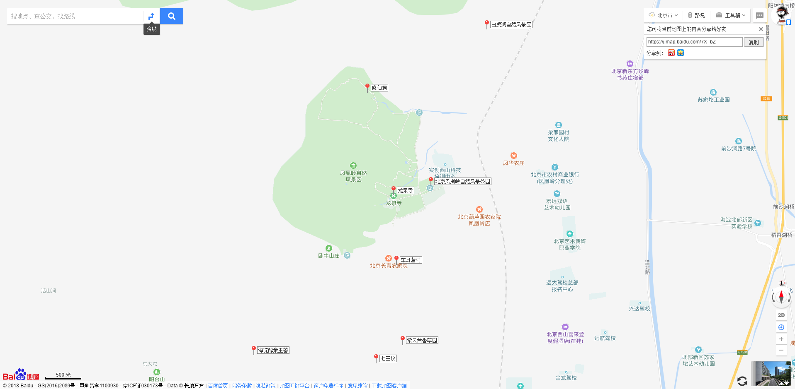

来一次说走就走的骑行！

# 1 骑行时间

出发时间：2018-08-19 08:00

回程时间：2018-08-19 16:00

# 2 骑行路线

出发点：西三旗桥

途径点：生命科学原 - 地铁站

目的地：凤凰岭自然风景区

行程：[https://j.map.baidu.com/l-XbZ](https://j.map.baidu.com/l-XbZ)；全程约 26.6 公里

回程：[https://goo.gl/maps/11m5oQm4GSF2](https://goo.gl/maps/11m5oQm4GSF2)；全程约 27.4 公里

# 3 活动

- [北京凤凰岭自然风景公园（普通票：25元；3-4小时）](http://www.mafengwo.cn/poi/4129.html)
- 午饭
- [龙泉寺（门票：24元；600 米）](http://www.mafengwo.cn/poi/5978850.html)
- [修仙洞（门票：25元；900 米）](http://www.mafengwo.cn/poi/806810.html)

推荐活动：

- [车耳营村（1.4 公里）](http://www.mafengwo.cn/poi/813292.html)
- [七王坟（1.9 公里）](http://www.mafengwo.cn/poi/813063.html)
- [紫云台香草园（2.5公里 ）](http://www.mafengwo.cn/poi/9431447.html)
- [海淀醇亲王墓（2.9公里 ）](http://www.mafengwo.cn/poi/6628359.html)
- [白虎涧自然风景区（门票60元，学生票/团票50元；2.7公里）](http://www.mafengwo.cn/poi/7318.html)

活动地图：[https://j.map.baidu.com/7X_bZ](https://j.map.baidu.com/7X_bZ)

# 4 骑行装备

## 个人装备

- 身份证（可能有用）
- 学生证

## 团队装备

- 打气筒
