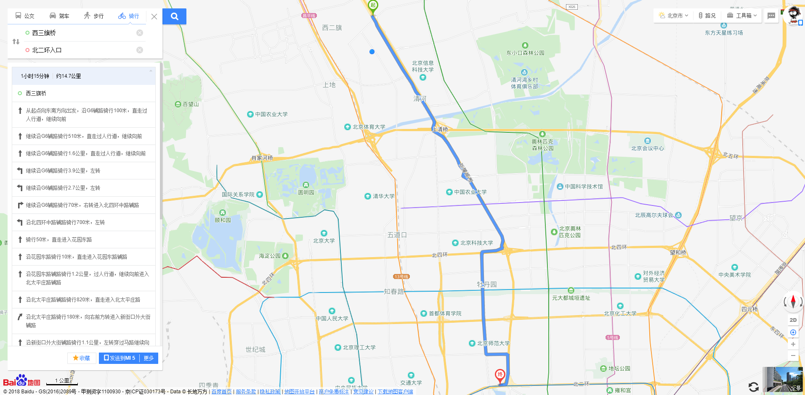
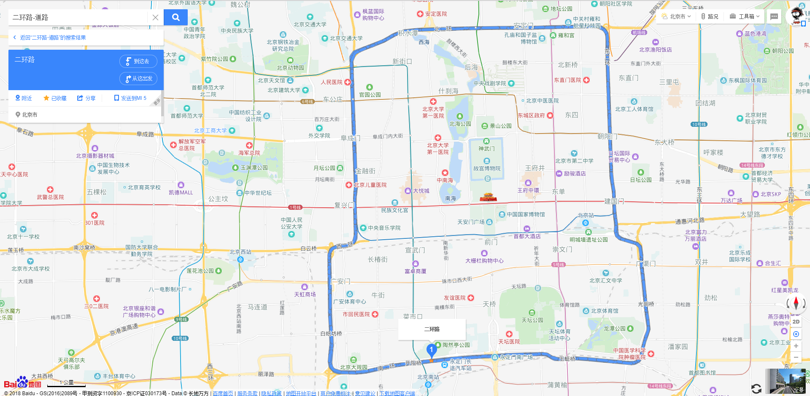
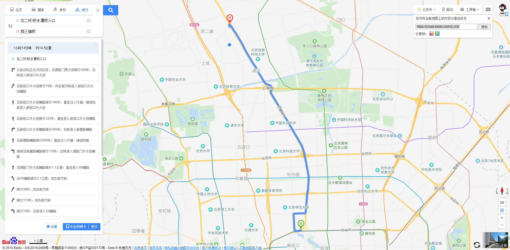

来一次说走就走的骑行！

# 1 骑行时间

预计时间：2018-09-02 07:00 ~ 2018-09-02 12:00

# 2 骑行路线

出发点：西三旗桥

目的地：西三旗桥

全程路线，约 61.9 公里

1. 西三旗桥 -> 北二环/积水潭桥入口（约 14.7 公里）: [https://j.map.baidu.com/k4n3Z](https://j.map.baidu.com/k4n3Z)

2. 二环（约 32.7 公里）：[北京二环路](https://map.baidu.com/?newmap=1&shareurl=1&l=14.156322592179535&tn=B_NORMAL_MAP&hb=B_SATELLITE_STREET&c=12955325,4825918&s=s%26da_src%3DsearchBox.button%26wd%3D%E4%BA%8C%E7%8E%AF%E8%B7%AF-%E9%81%93%E8%B7%AF%26c%3D131%26src%3D0%26wd2%3D%26pn%3D0%26sug%3D0%26l%3D14%26from%3Dwebmap%26biz_forward%3D%7B%22scaler%22%3A1%2C%22styles%22%3A%22pl%22%7D%26sug_forward%3D%26auth%3DwYKf6J01X167vwNHxJ0KSSLVG%3DcFDvb1uxHBHxNRxRVtzljPyBYYx1GgvPUDZYOYIZuztFexLwDJvRqqkqHf2PWv3GuzVtUvhgMZSguxVVVVVVVVVtWvPYuxt8zv7u%40ZPuVtcvY1SGpuxVtn1GDf0wd0vyICIyOOSMCu0kMMxACwDhheFQW%26device_ratio%3D1)

3. 北二环/积水潭桥入口 -> 西三旗桥（约 14.5 公里）：[https://j.map.baidu.com/3_n3Z](https://j.map.baidu.com/3_n3Z)

